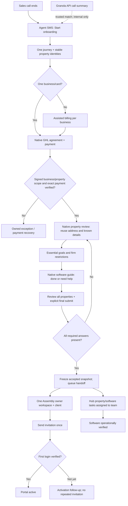

# Native GHL post-call onboarding V1

Status: implementation in progress, production disabled. Branch `codex/ghl-post-call-v1`.

## Outcome

A salesperson can start one onboarding journey after a call. The client signs and pays in GHL, confirms existing property details once, completes a short software guide, and explicitly submits. The system then provisions one owner workspace in Assembly and separately confirms their first login. Software verification remains a team responsibility.

## Delivery order and timeline

These are engineering estimates from the current draft, conditional on credentials and native integration proof; they are not launch commitments.

| Priority / milestone | Work and acceptance | Current state | Target |
|---|---|---|---|
| P0 — preserve commercial/property identity | Stable property UUIDs, assisted billing, signed document + invoice + Stripe verification, replay/revision guards | Implemented; synthetic tests pass; actual document field/Stripe correlation mapping remains unverified | Day 1 |
| P0 — native client experience | Property review, essential preferences, account software guide, final submit; no duplicate questions | Property draft created; secure native mounting, submit interception, upsert and resume still need provider proof | Days 1–2 |
| P0 — reliable portal handoff | Frozen submission, one company/client, durable write intents, independent activation, internal tasks | Implemented; fresh local SQL integration suite passes; credentials/custom fields required for live test | Days 2–3 |
| P1 — post-call context + recovery | Direct Granola API, trusted call matching, internal summary, 24h/72h recovery and 7-day human follow-up | Importer implemented; appointment mapping/credentials absent. Native reminder wiring remains pending | Days 2–3 |
| P0 — pilot and cutover | Three cases, failure/retry/opt-out checks, actual native contract/payment/forms/Assembly walkthrough | Not started. Keep current entry points until all gates pass | Day 4, or next available pilot window |

## Flow

## Product constraints

- Native GHL contract, payment and questionnaire UI. The Hub provides secure state/verification behind it.
- One business/card covers 1–5 properties. Multiple businesses/cards are assisted, with one final owner workspace.
- Standard $350/property/month; approved referral $320; one $150 setup fee per group. No child listings or deferred starts.
- Blank referral is standard; configured approved codes are case-insensitive; unknown codes need review.
- Client-only signature; signature-date effective; immediate billing/service start.
- Property address is captured once before agreement. Signed business/address fields must match the authenticated document. Corrections go to human review.
- Billing address is distinct from property address. Units and stable property IDs must survive every step.
- “Need guidance” is valid. No knowledge quiz at activation. Deeper education/comps follow in Assembly.
- Invitation, first login and verified software access are separate states.

## Runtime design

- `ghl_onboarding_journeys` stores pre-Assembly state with opaque expiring capabilities and optimistic revisions.
- `ghl_onboarding_commercial_bindings` prevents sharing one document/invoice/payment between journeys.
- Authenticated provider reads validate exact contact, location, USD amount, products, price, quantity, one-time fee, environment, signed scope and Stripe invoice metadata correlation.
- Public context/save APIs project only client-safe fields and permit questionnaire commands only. Commercial commands require the private webhook secret.
- Final submission is immutable. Durable Assembly checkpoints persist before create/invite; uncertain outcomes reconcile rather than blindly retry.
- Accepted identity normalizes into existing Hub onboarding runs/listings. Property UUIDs survive. Software and property review tasks are assigned to the configured Hub team profile.
- Granola reads notes directly, strips transcript/private fields, matches eligible sales calls deterministically, and persists internal summaries. Missing notes never block the journey.
- Versioned commands/events are the future agent boundary. Agents may propose corrections or follow-ups later; they cannot declare a payment or overwrite signed scope.

## Pilot acceptance

1. One property / standard price: $500 initial; known address appears in agreement and onboarding without retyping; one invite; first login observed.
2. Two properties / approved referral: $790 initial, same-street units remain distinct; explicit selected-property copying; no cross-tab overwrite.
3. Two legal businesses/cards: exact coverage, one setup fee, distinct documents/invoices/payments, one owner workspace.
4. For each, exercise duplicate webhook, timeout-after-write, stale revision, expired/wrong token, incomplete form, wrong document/address, partial/test-mode payment, opt-out and human takeover.
5. Recover a stranded case from its actual state; never bulk reenroll or resend contracts/invitations.

## Verification completed

- 504 tests across 61 files pass.
- Required TypeScript check and targeted ESLint pass.
- All six migrations apply to a fresh local PostgreSQL fixture schema; rollback integration suite passes, including portal handoff, owned tasks, stale leases, duplicate invoices, pause/resume and RLS.
- Native draft visual/conditional tests are recorded in the GHL implementation workspace; they do not yet prove a real submission.

## Remaining launch gates

See `docs/ghl/onboarding-v1-runbook.md` for exact configuration and evidence. Native drafts and passing unit tests are not end-to-end readiness. Do not flip enablement or move the salesperson SMS entry link until the secure native save path, real signed-document fields, payment correlation, correct owner assignment and Assembly handoff are demonstrated.
