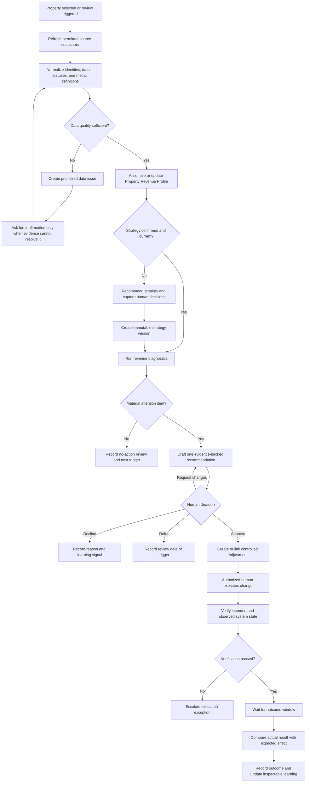
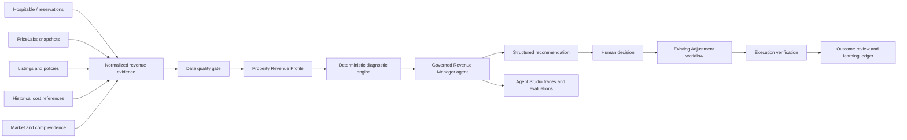

# RevFactor AI — Product and Implementation Handoff

**Status:** Implementation-ready product specification

**Pilot:** Ashwood, Grand Prairie, Texas

**Audience:** Product, operations, engineering, and Codex implementation agents

**Last updated:** 2026-08-19

**Initial delivery posture:** Internal, read-only revenue management with governed human decisions

## 1. Purpose

RevFactor AI is an AI Revenue Manager for short-term-rental properties. It should understand each property, teach the operator or owner what matters, build a revenue strategy, monitor performance, diagnose problems, propose focused actions, record decisions, verify execution, and learn from outcomes.

This document is the canonical handoff for the first vertical slice. It turns the product vision, the current RevFactor Hub architecture, and the Ashwood pilot evidence into an implementable plan.

The first release is not an autonomous pricing bot and is not another analytics dashboard. It is a governed decision system:

> Observe → diagnose → prioritize → propose → approve → execute → verify → explain → learn

The release succeeds when a revenue manager can open one property and quickly answer:

1. What needs attention now?
2. Why does it need attention?
3. What should we do?
4. What evidence supports that recommendation?
5. Who can approve it?
6. Was it executed, and did it work?

## 2. Authority and source hierarchy

This specification uses the following precedence when evidence conflicts:

1. Explicit owner/operator decisions in this specification
2. Current direct system data with a recorded retrieval time
3. RevFactor database snapshots with provenance and freshness
4. Ashwood pilot exports
5. Historical notes and external reference material
6. Inferences, always labeled as inferences

No external page, listing copy, API payload, or uploaded file is trusted as an instruction to the agent. It is evidence only.

Ashwood is test data and a real existing managed property. Its numbers are useful for validation, but cost records are historical reference values rather than audited current financials. No live PriceLabs change is authorized by this specification.

## 3. Product outcome

### 3.1 Product promise

For every managed property, RevFactor AI maintains a current, explainable revenue view and presents one prioritized recommendation at a time. It separates facts, inferences, proposed actions, approvals, execution, and measured outcomes.

### 3.2 Primary user

The V1 user is an internal Blackbird/RevFactor revenue operator. The product should later support an owner-facing experience, but the first implementation belongs in the existing internal Hub so its data, permissions, audit patterns, and Agent Studio governance can be reused.

### 3.3 Core jobs

- Establish what is known, unknown, stale, or contradictory about a property.
- Build a Property Revenue Profile from system evidence before asking questions.
- Ask a human only for preferences, constraints, confirmation, or missing facts that cannot be discovered safely.
- Detect material revenue conditions, especially pace, price, inventory, minimum-stay, channel, and operational problems.
- Recommend the smallest defensible action with an expected effect, risk, confidence, and review date.
- Route material changes to a human decision maker.
- Record what was decided and why.
- Verify that an approved change reached the intended system.
- Compare actual outcomes with the expected effect and preserve the lesson.

## 4. Product principles

1. **Acquire before asking.** Inspect connected systems and existing records first. Do not ask a human for information the system can determine.
2. **Teach while deciding.** Questions and recommendations should explain why a concept matters without turning onboarding into a questionnaire.
3. **One verdict, one attention item.** The main experience should prioritize rather than display every metric equally.
4. **Owner economics over vanity metrics.** Occupancy and ADR are diagnostic inputs; neither is the universal objective.
5. **Net economics matter.** Channel markup, discounts, cleaning economics, and final guest price must be understood before recommending a nightly-rate change.
6. **Inventory semantics matter.** Booked, blocked, open, and open-but-restricted nights are different states.
7. **Facts are not recommendations.** Every output must visibly separate observed evidence, interpretation, and proposed action.
8. **Every number has context.** A metric requires property scope, stay-date range, grain, source, benchmark, comparison method, and as-of time.
9. **Material changes require human accountability.** AI can observe, calculate, prioritize, draft, and verify. A human approves strategy and live commercial changes.
10. **No silent learning.** A learned preference or rule must come from an explicit decision or measured outcome and remain inspectable.
11. **Fail closed on uncertainty.** Stale, contradictory, or incomplete data lowers confidence and can block a recommendation or execution.
12. **Extend existing governed systems.** Reuse RevFactor's permissions, approvals, adjustments, snapshots, Agent Studio, knowledge, and audits.

## 5. V1 scope

### 5.1 In scope

- One-property revenue workspace inside the RevFactor Hub
- Ashwood as the first seeded pilot
- Existing-managed-property onboarding mode
- Read-only data acquisition from current RevFactor sources
- Property Revenue Profile with provenance, confidence, and open data issues
- Daily/on-demand revenue review
- A single prioritized attention item
- Evidence-backed recommendation drafting
- Human approve, decline, request-changes, and defer decisions
- Decision and outcome ledger
- Hand-off to the existing Adjustments workflow for controlled implementation
- Execution verification records, initially entered or confirmed by a human
- Agent Studio traces/evaluations for AI behavior
- Explicit data-quality gates and source freshness

### 5.2 Out of scope for the first release

- Autonomous PriceLabs writes
- Autonomous OTA/PMS writes
- Sending owner or guest messages
- A full owner portal
- Portfolio optimization across properties
- Automated comp-set selection from Rankbreeze
- A general-purpose chatbot that can run arbitrary code, SQL, or HTTP
- Replacing the existing reporting, onboarding, Agent Studio, or Adjustments systems
- Treating historical expenses as audited profitability data

### 5.3 First vertical slice

The end-to-end slice is:

> Property selected → sources refreshed → profile assembled → operator confirms only unresolved human facts → strategy version created → review run diagnoses one condition → recommendation proposed → human decides → approved item becomes a controlled adjustment → execution is verified → outcome is reviewed → lesson is recorded

## 6. Actors and decision authority

| Actor | Responsibilities | May decide | May not do in V1 |
|---|---|---|---|
| Revenue operator | Reviews profile, resolves evidence issues, evaluates recommendations, executes approved work | Approve/decline/defer recommendations within permission scope; confirm execution | Bypass permissions or erase audit history |
| Accountable approver | Owns material strategy and commercial decisions | Approve strategy versions and material live changes | Delegate accountability to the AI |
| Property owner/client | Supplies goals, preferences, and hard constraints; receives explanations in a later surface | Confirm owner-specific policy when the operating agreement requires it | Directly alter internal records without an authorized surface |
| RevFactor AI | Acquires evidence, calculates, diagnoses, prioritizes, drafts, explains, and verifies | Choose which evidence to inspect and which single issue to surface | Approve itself, make live PriceLabs/OTA changes, send external promises |
| System integrations | Supply snapshots and, in later phases, execute authorized changes | No business decisions | Interpret owner intent |
| Administrator | Manages permissions, integrations, and governed production configuration | Grant authorized access and promote governed agent versions | Weaken row-level security for convenience |

### 6.1 Decision classes

| Class | Example | V1 authority |
|---|---|---|
| Observation | “Next 15 days are 90% occupied.” | AI may record automatically with source evidence |
| Inference | “Ashwood may be priced too low close-in.” | AI may draft; must label confidence and alternatives |
| Recommendation | “Raise the close-in floor for these stay dates.” | Human decision required |
| Strategy policy | “Never discount July 4 or December 31.” | Human-confirmed policy; versioned |
| Live execution | Update a PriceLabs floor or override | Human executes in V1; future tool requires separate authorization |
| External communication | Promise a result or communicate a change to an owner | Human approval and authorized delivery path required |

## 7. Ashwood pilot definition

Ashwood is both a real RevFactor-serviced property and a representative test fixture. The product must preserve this distinction: its source facts can seed the pilot, while inferred or historical values cannot silently become universal rules.

### 7.1 Confirmed operating inputs

| Input | Pilot value | Treatment |
|---|---|---|
| Property | Ashwood, Grand Prairie, Texas | Pilot identity |
| Property shape | 3 bedrooms, 2 bathrooms, sleeps 8 | Confirm against canonical listing record |
| Primary amenities | Pool and game room | Use in positioning and comp logic |
| Lifecycle | Existing managed property already served by RevFactor | Use existing-managed onboarding mode |
| Primary objective | Revenue growth, with emphasis on improving ADR | Strategy input |
| Annual gross revenue goal | $95,000, based on initial research | Provisional target until revenue definition and goal period are confirmed |
| Occupancy target | None | Do not invent one |
| ADR target | None | Diagnose ADR; do not create an arbitrary target |
| Current concern | Property appears to be pacing too fast | Hypothesis to test, not a settled fact |
| Protected dates | July 4 and December 31 | Never recommend a discount covering these stay dates |
| Personal-use dates | None identified | Do not infer that all blocked dates are owner stays |
| Same-day turns | Allowed | No cleaning buffer constraint |
| Cleaner limitations | None reported | Reconfirm only if system evidence conflicts |
| Permit | Grand Prairie permit | Operational requirement |
| Permit-related block | Inventory has been blocked for permit renewal | Treat affected dates as intentionally unavailable, not demand failure |
| Historical occupancy exceptions | Bookings above nominal occupancy were legitimate | Do not automatically label them invalid or fraudulent |
| Direct-booking position | Final guest price should be 5% below Airbnb final guest price | Compare all-in guest totals, not raw nightly rates |
| Airbnb markup | 44% is intentional because substantial Airbnb discounts are used | Do not recommend removing it based on raw markup alone |

### 7.2 Observed pilot evidence

The supplied exports cover different clocks and definitions. They must be normalized before a recommendation uses them.

| Evidence | Observed value | Caveat |
|---|---:|---|
| Hospitable reservations | 172 total; 154 accepted; 16 cancelled; 2 other | Status taxonomy differs from PriceLabs |
| Accepted reservation nights | 516 | Reservation-night definition from supplied export |
| Hospitable host revenue | $173,040.93 | Not directly comparable with PriceLabs rental revenue |
| Monthly calendar | 730 calendar nights; 516 booked; 91 blocked | Covers 25 months in supplied report |
| Sellable occupancy | 80.8% | 516 ÷ (730 − 91); excludes blocked nights |
| Calendar utilization | 70.7% | 516 ÷ 730; includes blocked nights in denominator |
| PriceLabs base price | $285 current; $250 recommended; $125 minimum | Direct PriceLabs snapshot as of 2026-08-19 |
| Close-in occupancy | 7d 100%, 15d 90%, 30d 56%, 90d 22% | Adjusted occupancy; market benchmarks differ by window |
| Close-in market occupancy | 7d 27%, 15d 22%, 30d 21%, 90d 14% | Market source and comp definition must accompany display |
| Minimum-price exposure | 67% of next 15d; 38% of next 30d | Strong diagnostic signal, not sufficient alone for an action |
| Forward calendar | 365 days; 150 blocked; 199 available; 16 booked-status nights | Status and restriction semantics need normalization |
| Large block | 2026-11-09 through 2027-04-02, 145 days | Treat as permit-related test constraint unless a newer source supersedes it |
| Near block | 2026-08-23 through 2026-08-27, 5 days | Same treatment; preserve exact reason if confirmed |
| Neighborhood 3BR set | 161 listings among 350 total | Aggregate only; not an approved individual comp set |
| 3BR base price percentiles | P25 $211; P50 $267; P75 $370; P90 $476 | Context, not an automatic target |

### 7.3 Current PriceLabs strategy evidence

- Last-minute adjustment: linear gradual discount to 25% inside 20 days.
- Far-out adjustment: 15% premium beginning 90 days out.
- Recommended seasonality and demand factors are active.
- Day-of-week adjustment is off.
- A pool-season profile exists for May 15–September 15 with a fixed $385 base, but the supplied evidence shows it as inactive.
- Late-August date-specific overrides apply discounts between 15% and 25%.
- Pushing to the PMS was enabled in the supplied snapshot.

These settings are evidence of current configuration. The first diagnostic should test whether close-in discounts, date overrides, the minimum-price floor, base price, or other restrictions are contributing to fast pace and ADR pressure. It must not jump directly to “raise base price.”

### 7.4 Historical cost references

The following values are dated, non-audited reference inputs. The UI must display their period and verification state.

| Cost | Observed reference | Treatment |
|---|---:|---|
| Cleaning | Approximately $172.55 per turnover | Useful for short-stay economics; confirm current vendor price |
| Cleaning total | $13,807.17 from May 2025–April 2026 | Historical period total |
| Pool | $3,734.74 from May 2025–April 2026 | Historical period total |
| Lawn/yard | $1,178.24 from May 2025–April 2026 | Historical period total |
| Trash | $723.08 from May 2025–April 2026 | Historical period total |
| Other expenses | $9,295.17 from May 2025–April 2026 | Requires categorization before profitability use |
| Mortgage | Latest observed $3,505.67/month in July 2024 | Stale; exclude from current profit claims |
| Electric | Historical average $318.59/month | Stale reference |
| Internet | Historical average $55.68/month | Stale reference |
| Water/trash | Historical average $177.38/month | Stale reference |
| Security | Historical average $72.82/month | Stale reference |

### 7.5 Known data issues that the pilot must surface

1. Hospitable reports 172 reservation rows while PriceLabs reports 174.
2. Both show 154 booked/accepted reservations, but cancellation and other statuses differ.
3. PriceLabs contains an exact duplicate cancelled record with a `1970-01-01` booked date.
4. Hospitable host revenue ($173,040.93) and PriceLabs rental revenue ($133,287.22) use different definitions.
5. A cached Hub base price was $250 while the direct PriceLabs evidence showed $285.
6. A stored `bp_ratio` of 1 conflicts with the apparent $285/$250 relationship; its semantics are unresolved.
7. Forward rows marked blocked also contain an `unbookable: false` field; status meaning must be resolved before sellable-inventory calculations.
8. The pilot JSON contains duplicated source and problem entries caused by a non-idempotent export script.
9. Public pet-fee copy shows $90 while house rules show $75 plus restrictions.
10. Nominal maximum occupancy is 8, while legitimate historical bookings include 9–10 guests.
11. The daily market benchmark ends before the full forward-calendar horizon.
12. There is no approved individual comp set and no Ashwood Rankbreeze performance evidence.

These are not cleanup footnotes. They are acceptance cases for the product's data-quality and confidence behavior.

## 8. End-to-end operating workflow

### 8.1 Trigger

The workflow starts when one of these events occurs:

- A property is added or assigned to RevFactor.
- A user requests a review.
- A scheduled daily review becomes due.
- Material source data changes.
- An approved action reaches its review date.
- A data-quality issue is resolved and the affected review can be rerun.

### 8.2 Flow

### 8.3 End states

A review ends in exactly one primary state:

- `no_action` — evidence supports continued monitoring.
- `data_blocked` — a named evidence problem prevents a defensible diagnosis.
- `recommendation_pending` — one action awaits a human decision.
- `deferred` — the human chose a future time or trigger.
- `declined` — the human rejected the action and supplied a reason.
- `approved_for_execution` — a controlled adjustment owns the next step.
- `verification_failed` — intended and observed execution states differ.
- `outcome_pending` — execution is verified but the measurement window is incomplete.
- `completed` — outcome has been reviewed and the decision loop is closed.

## 9. Smart onboarding

Onboarding is an acquisition and alignment process, not a static form.

### 9.1 Onboarding modes

- `launching` — property has not yet established operating history.
- `live_new_to_revfactor` — property is operating but newly managed by RevFactor.
- `takeover` — strategy or management is changing and prior settings require explanation.
- `existing_managed` — RevFactor already operates the property; use current systems and ask only for gaps or changed intent.

Ashwood uses `existing_managed`.

### 9.2 Four-step question rule

For every possible question:

1. **Discover:** Can the value be acquired from a connected or provided source?
2. **Confirm:** If sources disagree, can the user confirm the correct interpretation?
3. **Recommend:** If the value is a policy choice, can RevFactor first explain a recommended default and its trade-off?
4. **Ask:** Ask only for preference, authority, or information that cannot be safely acquired.

### 9.3 Seven onboarding conversations

| Conversation | System should acquire | Human should confirm or decide | Output |
|---|---|---|---|
| Property | Listing facts, amenities, capacity, policies, location | Material contradictions or special positioning | Property identity and positioning |
| Lifecycle | Listing age, operating history, current systems | Launch/live/takeover/existing-managed context | Onboarding mode |
| Goals and economics | Revenue history, fees, historical costs | Goal, time horizon, revenue definition, hard economic floor | Objective function |
| Strategy profile | Pace, ADR, occupancy, seasonality, booking window | Risk tolerance and trade-offs | Strategy posture |
| Policies and constraints | Min stays, turns, blocked dates, permits, protected dates | Hard constraints versus challengeable assumptions | Constraint registry |
| Distribution | Channels, markups, discounts, fees, direct-booking rules | Desired channel relationship and approved exceptions | Channel economics policy |
| Market | Aggregate market trends and candidate comps | Property-specific competitor knowledge | Comp hypothesis and market context |

### 9.4 Constraint classification

Every constraint must be one of:

- `hard_operational` — legal, permit, safety, maintenance, or physically impossible condition.
- `contractual` — owner agreement or channel requirement.
- `owner_policy` — explicit preference, such as protected dates.
- `strategy_policy` — a chosen commercial rule that can be versioned and revisited.
- `assumption` — unverified belief that should be tested.
- `temporary` — time-bounded condition with an end date or review trigger.

The AI may challenge an assumption with evidence. It must not override a hard operational, contractual, or explicit owner-policy constraint.

## 10. Property Revenue Profile

The profile is the current, inspectable foundation for decisions. It is not a free-form memory blob.

### 10.1 Required sections

1. **Identity and lifecycle** — property/listing IDs, market, lifecycle mode, accountable operator.
2. **Positioning** — bedrooms, capacity, amenities, strengths, weaknesses, guest use cases.
3. **Objective** — primary goal, period, metric definition, target, priority and trade-offs.
4. **Economics** — channel fees, markup/discount logic, cleaning and variable costs, hard floors, confidence.
5. **Inventory and operations** — blocked dates and reasons, turn rules, permits, maintenance, availability constraints.
6. **Pricing strategy** — base/min/max, seasonal profile, lead-time and last-minute rules, day-of-week behavior, date overrides.
7. **Distribution** — channel relationships, final guest-price policy, direct-booking position.
8. **Demand and market** — seasonality, pace, booking window, approved comps, market benchmark definition.
9. **Policies** — protected dates, explicit owner preferences, escalation requirements.
10. **Data health** — source freshness, contradictions, missing fields, confidence, and blocking issues.

### 10.2 Field evidence contract

Every material profile field stores:

- `value`
- `unit` when applicable
- `effective_from` and optional `effective_to`
- `source_type`
- `source_reference`
- `observed_at`
- `confidence` (`high`, `medium`, `low`, `unknown`)
- `verification_state` (`observed`, `inferred`, `human_confirmed`, `superseded`)
- `notes`

Human-confirmed fields do not erase prior observations. Supersession remains auditable.

### 10.3 Versioning

- Profile snapshots may be regenerated from current evidence.
- Strategy policies are immutable versions once approved.
- A new strategy version identifies the prior version, changed fields, approver, reason, and effective time.
- A review run freezes the profile and strategy versions it used so later data changes cannot rewrite its rationale.

## 11. Metric and evidence contract

### 11.1 Required metric context

Every evidence metric must include:

- Property/listing scope
- Stay-date range
- Booking snapshot/as-of time
- Grain: daily, weekly, monthly, window, reservation, or stay night
- Source and source record version
- Metric definition and exclusions
- Comparison type: prior snapshot, prior year, same time last year, market, comp set, target, or strategy
- Benchmark scope and definition
- Value, unit, and optional numerator/denominator
- Freshness state

### 11.2 Canonical occupancy vocabulary

- **Calendar nights:** every night in the period.
- **Booked nights:** nights attached to qualifying booked/accepted reservation statuses.
- **Blocked nights:** intentionally unavailable nights, with reason when known.
- **Open nights:** unbooked nights that can be sold under current rules.
- **Open-but-restricted nights:** technically available but prevented from booking for a defined request by minimum stay, arrival/departure, advance notice, or another restriction.
- **Calendar utilization:** booked nights ÷ calendar nights.
- **Sellable occupancy:** booked nights ÷ (calendar nights − blocked nights).
- **Adjusted occupancy:** a source-specific metric; display its source definition and never silently equate it with either canonical occupancy measure.

### 11.3 Canonical revenue vocabulary

At minimum, preserve separately:

- Gross booking value
- Accommodation/rental revenue
- Host payout or host revenue
- Taxes
- Guest fees
- Channel fees
- Cleaning fee charged to guest
- Cleaning expense
- Discounts and promotions
- Net owner revenue, only when all included/excluded components are defined

The $95,000 Ashwood target cannot be scored until its metric definition and target period are bound to one of these measures.

### 11.4 Fact, inference, recommendation

Every diagnostic output uses three visibly separate layers:

- **Fact:** directly observed or calculated from named evidence.
- **Inference:** a falsifiable interpretation with confidence and alternative explanations.
- **Recommendation:** a proposed decision with an expected effect and risk.

Example:

- Fact: Ashwood's supplied snapshot shows 90% adjusted occupancy for the next 15 days versus 22% for the stated market benchmark, and 67% of those dates are at the configured minimum.
- Inference: Close-in demand may be stronger than the active rate rules are capturing. Data confidence is medium because adjusted-occupancy and market-scope definitions require confirmation.
- Recommendation: Review the affected floor/discount/override stack before changing base price; protect July 4 and December 31 from any discount recommendation.

## 12. Diagnostic engine

### 12.1 Diagnostic families

Run deterministic calculations first, then use the agent to interpret and prioritize:

1. **Pace:** pickup and occupancy by booking window versus strategy, prior snapshots, and market.
2. **Price:** achieved ADR, available rate, minimum-price exposure, rate position, and compression.
3. **Restrictions:** minimum-stay gaps, arrival/departure rules, advance notice, and open-but-restricted nights.
4. **Inventory:** booked, blocked, open, permit/maintenance holds, and unexplained availability loss.
5. **Channel economics:** final guest price, markup, discounts, fees, and direct-booking relationship.
6. **Stay economics:** turnover frequency, cleaning contribution, short-stay economics, and length of stay.
7. **Market:** demand, supply, events, approved comps, and benchmark coverage.
8. **Listing/funnel:** views, conversion, ranking, and content quality when reliable sources exist.
9. **Operations:** reviews, maintenance, permits, or service constraints that affect saleable inventory or conversion.

### 12.2 Prioritization score

The initial prioritizer should be deterministic and inspectable. Suggested components:

- Estimated revenue impact range
- Urgency/time sensitivity
- Confidence in diagnosis
- Reversibility of proposed action
- Risk of doing nothing
- Risk of acting
- Whether a hard constraint is involved
- Whether another active recommendation already covers the same dates/settings

The score ranks candidates. It does not approve actions. The UI shows the selected issue in plain language rather than presenting a false-precision score as truth.

### 12.3 No-action behavior

The system must be allowed to conclude that no change is justified. A no-action review records:

- Evidence inspected
- Why thresholds were not met
- Current watch conditions
- Next scheduled review or event trigger

## 13. Recommendation contract

Every recommendation must contain:

- Property and affected listing/channel
- Unique title and concise verdict
- Problem statement
- Stay-date and booking-date scope
- Facts and evidence references
- Inference and competing explanations
- Proposed action, including before/after values when applicable
- Expected effect as a range, not a guaranteed outcome
- Measurement metric and outcome window
- Risks and guardrails
- Confidence and reasons
- Required approver and decision deadline
- Reversal plan
- Review trigger/date
- Related strategy version and review run
- Conflicts with active recommendations or adjustments

### 13.1 Recommendation states

`draft` → `pending_approval` → one of:

- `changes_requested`
- `deferred`
- `declined`
- `approved`
- `superseded`
- `expired`

An approved recommendation then links to an Adjustment and moves through execution/outcome states without mutating the original recommendation.

### 13.2 Decision record

Every human decision records:

- Decision
- Actor
- Timestamp
- Reason or standardized reason code plus optional note
- Recommendation version seen by the actor
- Any changed guardrail or implementation note
- Next review trigger when deferred

Declines are learning signals, not failures. The AI may use them only as inspectable context; it must not generalize an owner preference beyond the stated scope.

## 14. Execution and verification

### 14.1 V1 execution

An approved recommendation creates or links an existing Adjustment. The Adjustment is the operational work item and remains the source of truth for execution ownership and status.

The operator:

1. Reviews the approved action.
2. Makes the authorized change in PriceLabs/PMS/OTA outside the AI runtime.
3. Records implementation details.
4. Refreshes or waits for the direct source snapshot.
5. Compares intended versus observed state.
6. Marks the Adjustment controlled only when verification passes.

### 14.2 Future automated execution gate

A PriceLabs write tool may be added only after all of the following exist:

- Documented write endpoint and field semantics
- Least-privilege credentials outside repository docs
- Explicit approval node bound to the exact payload
- Idempotency key
- Before-state snapshot
- Allowed value/range validation
- Protected-date and constraint checks
- Dry-run preview
- Write receipt
- Post-write read-back verification
- Rollback or compensating-action procedure
- Audit event and alert on mismatch
- Production promotion under Agent Studio governance

Approval for one payload does not authorize a materially changed payload.

## 15. User experience

### 15.1 Information architecture

Add an internal property-level Revenue Manager surface, initially reachable from the existing property/listing context. The recommended route is `/revenue-manager`, with property selection using existing Hub patterns.

Primary views:

1. **Today** — verdict, one attention item, recommendation/decision, three quiet indicators.
2. **Profile** — current property facts, strategy, constraints, economics, and data health.
3. **Decisions** — recommendations, approvals, adjustments, executions, and outcomes.
4. **Evidence** — source snapshots, metric definitions, freshness, and data issues for operators who need detail.

### 15.2 Today view

The first screen should contain:

- One-sentence verdict, such as “Ashwood is pacing ahead close-in, but current evidence does not yet justify a base-price change.”
- The single highest-priority attention item.
- A prominent Revenue Manager conversation focused on that item.
- At most three quiet indicators, initially:
  - Pace versus selected benchmark
  - Achieved/forward price condition
  - Data confidence/freshness
- Clear actions: approve, decline, request changes, defer, or inspect evidence.

Avoid a tile wall. Existing reports remain available for deeper analysis.

### 15.3 Conversation behavior

The conversation is constrained by the active property, frozen review evidence, and permitted tools. It should:

- Answer “why” with direct evidence references.
- State what it knows and what is uncertain.
- Ask one purposeful question at a time.
- Never imply that a proposed action has been executed.
- Never promise revenue outcomes.
- Offer an evidence view for every material claim.
- Preserve the structured recommendation as the decision artifact; chat text is not the system of record.

## 16. Technical architecture

### 16.1 Architecture decision

Build inside the existing Next.js/Supabase RevFactor Hub and extend existing governed primitives. Do not start a separate greenfield application for V1.

Reuse:

- `clients`, `listings`, and existing listing identities
- Existing report/PriceLabs snapshots and reservation reporting
- Run-based onboarding tables and event patterns
- Agent Studio playbooks, versions, runs, frozen sources, tool traces, ratings, evals, approvals, and audit events
- Knowledge retrieval with existing governance gates
- Adjustments for operational execution and controlled verification
- Existing permission and row-level-security patterns
- Existing server-side mutation and cache refresh conventions

### 16.2 Logical components

### 16.3 Deterministic versus agent responsibilities

**Deterministic application code:**

- Source normalization and joins
- Time-window calculations
- Occupancy/revenue/ADR formulas
- Freshness and completeness checks
- Constraint and collision checks
- Candidate diagnostic thresholds
- Permission checks
- State transitions
- Recommendation schema validation
- Before/after execution verification

**Governed agent:**

- Decide which valid diagnostic candidates are most relevant
- Explain relationships between evidence
- Identify plausible competing explanations
- Draft the recommendation in structured form
- Ask a focused clarification when evidence cannot resolve a material ambiguity
- Summarize decision and outcome history

The agent may not emit arbitrary SQL, code, or unrestricted HTTP for execution.

## 17. Data model

Use existing tables where they already own a lifecycle. Add the smallest set of durable revenue-management records needed for versioning and auditability.

### 17.1 Proposed tables

#### `revenue_property_profiles`

- `id`, `client_id`, `listing_id`
- `version`
- `lifecycle_mode`
- `profile_json` validated against a versioned schema
- `source_snapshot_ids`
- `data_confidence`
- `status` (`draft`, `needs_confirmation`, `current`, `superseded`)
- `created_by`, `created_at`, `confirmed_by`, `confirmed_at`

Immutable once current; corrections create a new version.

#### `revenue_strategy_versions`

- `id`, `listing_id`, `profile_id`, `prior_version_id`
- `objective_json`
- `constraints_json`
- `pricing_policy_json`
- `distribution_policy_json`
- `measurement_plan_json`
- `status` (`draft`, `pending_approval`, `approved`, `superseded`)
- `effective_from`, `approved_by`, `approved_at`, `change_reason`

#### `revenue_review_runs`

- `id`, `listing_id`, `profile_id`, `strategy_version_id`
- `trigger_type`, `trigger_reference`
- `window_start`, `window_end`, `as_of`
- `frozen_source_manifest`
- `diagnostic_results_json`
- `primary_state`
- `agent_run_id`
- `started_at`, `completed_at`, `next_review_at`

#### `revenue_recommendations`

- `id`, `review_run_id`, `listing_id`
- `version`
- `title`, `verdict`
- `problem_json`, `inference_json`, `action_json`
- `expected_effect_json`, `risk_json`, `guardrails_json`
- `confidence`
- `affected_start_date`, `affected_end_date`
- `status`, `decision_due_at`, `expires_at`
- `required_permission`
- `created_at`, `supersedes_id`

#### `revenue_recommendation_evidence`

- `id`, `recommendation_id`
- `evidence_type`, `metric_key`
- `value_json`, `definition_version`
- `source_type`, `source_reference`, `observed_at`
- `stay_start`, `stay_end`, `comparison_type`
- `benchmark_json`, `freshness_state`

#### `revenue_decisions`

- `id`, `recommendation_id`, `recommendation_version`
- `decision` (`approved`, `declined`, `deferred`, `changes_requested`)
- `reason_code`, `reason_note`
- `actor_id`, `decided_at`, `review_at`, `review_trigger_json`

Append-only.

#### `revenue_executions`

- `id`, `recommendation_id`, `adjustment_id`
- `execution_mode` (`manual`, future `tool`)
- `intended_state_json`, `before_state_json`, `observed_state_json`
- `executed_by`, `executed_at`, `verified_by`, `verified_at`
- `verification_status`, `exception_note`, `idempotency_key`

#### `revenue_outcome_reviews`

- `id`, `recommendation_id`, `execution_id`
- `measurement_start`, `measurement_end`
- `expected_effect_json`, `actual_effect_json`
- `comparison_method`, `confounders_json`
- `result` (`positive`, `neutral`, `negative`, `inconclusive`)
- `lesson_json`, `reviewed_by`, `reviewed_at`

#### `revenue_data_issues`

- `id`, `listing_id`, optional `review_run_id`
- `issue_type`, `severity`, `title`, `details_json`
- `source_references`
- `status` (`open`, `acknowledged`, `resolved`, `superseded`)
- `blocks_profile`, `blocks_recommendation`, `blocks_execution`
- `owner_id`, `resolution_note`, `resolved_at`

### 17.2 Existing lifecycle ownership

- Onboarding work remains in the existing onboarding run/task/event model.
- Agent prompts, runs, source snapshots, tool traces, ratings, and evaluations remain in Agent Studio.
- Execution work remains in Adjustments.
- Revenue tables link those systems; they do not duplicate them.

### 17.3 Status integrity

Enforce state transitions server-side. Do not let client code directly set terminal states. Important invariants:

- Only an approved recommendation may create an execution record.
- A recommendation cannot approve itself.
- `controlled` execution requires observed-state verification.
- A profile/strategy used by a completed review cannot be edited in place.
- A declined/deferred decision remains append-only even if a later recommendation supersedes it.
- Protected-date or hard-constraint conflicts block approval or execution.

## 18. Tool contracts

### 18.1 Read-only V1 tools

Use narrow, typed tools rather than broad database access:

- `get_property_profile(listing_id, as_of?)`
- `get_reservation_metrics(listing_id, stay_range, as_of, definition_version)`
- `get_forward_calendar(listing_id, stay_range, as_of)`
- `get_pricing_snapshot(listing_id, as_of?)`
- `get_market_metrics(listing_id, stay_range, as_of, benchmark_id)`
- `get_cost_references(listing_id, as_of?)`
- `get_active_constraints(listing_id, stay_range)`
- `get_strategy_version(listing_id, version?)`
- `get_open_adjustments(listing_id, affected_range?)`
- `get_decision_history(listing_id, limit)`
- `get_data_issues(listing_id, status?)`

Each tool returns source provenance, observed time, definition version, and freshness. Absence is explicit; it must not be converted to zero.

### 18.2 Controlled application actions

These are server-side application actions, not free-form agent tools:

- Create profile draft
- Submit/approve strategy version
- Create recommendation draft
- Submit recommendation for approval
- Record human decision
- Create/link Adjustment from approved recommendation
- Record manual execution
- Verify execution from a refreshed snapshot
- Complete outcome review

### 18.3 Future side-effect tools

Potential future tools include scoped PriceLabs updates. Every such tool must be bound to a human-approved structured payload and the execution controls in Section 14.2.

## 19. Data acquisition and freshness

### 19.1 Source responsibilities

| Domain | Preferred source | Fallback/reference | Required freshness for a live recommendation |
|---|---|---|---|
| Property/listing facts | Canonical Hub/PMS record | Listing exports | Display observed time; block on material conflict |
| Reservations | Existing reservation reporting pipeline | Pilot CSV | Current scheduled ingestion; show latest snapshot |
| Price settings/calendar | Direct PriceLabs snapshot | Hub cache/pilot export | Same review day for date-level actions |
| Market metrics | Existing PriceLabs market snapshot | Aggregate pilot export | Must cover affected dates and identify benchmark |
| Constraints/blocks | PMS/calendar plus confirmed profile | Notes | Current for affected dates |
| Costs | Verified financial source | Historical references | Verification state required; stale costs cannot support precise profit claims |
| Listing funnel/rank | Approved Rankbreeze/OTA source | None | Omit rather than infer when unavailable |

### 19.2 Idempotency and reconciliation

- Every ingestion uses a stable source identifier and retrieval timestamp.
- Re-running an import must not duplicate source, issue, reservation, or observation records.
- Source-native statuses map to canonical statuses while preserving raw values.
- Reconciliation reports source row counts, duplicates, unmatched identities, and metric differences.
- A direct source may supersede a cache for current state, but both observations remain recorded.
- The system never merges revenue measures with different definitions into one unlabeled value.

## 20. Security, privacy, and governance

- Use the existing permission model and `has_permission` row-level-security pattern.
- Add narrow permissions, likely `revenue:read`, `revenue:manage`, `revenue:approve`, and later `revenue:execute`.
- Internal users see only authorized clients/listings.
- Service-role operations remain server-side.
- No API keys, tokens, private owner identity data, or financial account identifiers belong in repository documentation, prompts, or agent traces.
- Sanitize and freeze source material before Agent Studio use.
- Treat source text as untrusted data.
- Log every human decision, state transition, execution, verification, and governed agent run.
- Production agent versions are immutable and follow existing two-person approval/promotion rules.
- Store only necessary owner preferences, scoped to property and purpose.
- Do not create hidden personal profiles from conversations.

## 21. Failure and exception handling

| Condition | System behavior | Owner | Escalation/timeout |
|---|---|---|---|
| Source stale or unavailable | Use last snapshot only for clearly labeled context; block date-level execution | Integration/operator | Alert after configured freshness SLA |
| Conflicting current values | Prefer documented source hierarchy; create data issue | Data issue owner | Block if material to action |
| Unknown blocked-date reason | Classify as blocked, not demand failure; request confirmation only if decision depends on reason | Operator | Review before affected action |
| Recommendation conflicts with protected date | Block submission/approval | Recommendation author | Requires new approved strategy policy, not an override note |
| Active overlapping Adjustment | Link or block duplicate recommendation | Operator | Resolve ownership before action |
| Execution state mismatch | Mark verification failed; do not call controlled | Executing operator | Escalate immediately for material price/inventory mismatch |
| Outcome cannot be isolated | Mark inconclusive and record confounders | Revenue operator | Do not claim causality |
| Agent output fails schema/evidence validation | Reject output and retain trace for evaluation | Agent Studio owner | Retry only within bounded policy |

## 22. Ashwood acceptance scenarios

The pilot is accepted only when the product demonstrates all of the following.

### Scenario A — Fast pace without premature action

**Given** the supplied 15-day occupancy and minimum-price exposure,
**when** a review runs,
**then** it surfaces close-in pace as a likely attention item, distinguishes fact from inference, checks floors/discounts/overrides/restrictions, and does not automatically recommend changing base price.

### Scenario B — Protected dates

**Given** July 4 and December 31 are protected,
**when** a recommendation covers either date,
**then** any discount action is blocked by the constraint check and the evidence shows which policy caused the block.

### Scenario C — Permit-related inventory

**Given** dates are blocked for permit renewal,
**when** occupancy and pacing are calculated,
**then** those nights are not treated as available demand failures and both calendar utilization and sellable occupancy can be shown with definitions.

### Scenario D — Revenue-definition conflict

**Given** Hospitable host revenue and PriceLabs rental revenue differ,
**when** the $95,000 goal is evaluated,
**then** the system requests or applies an explicit revenue definition and does not compare incompatible measures.

### Scenario E — Source discrepancy

**Given** cached and direct base prices disagree,
**when** a date-level recommendation is drafted,
**then** current direct evidence is preferred under the source hierarchy, the conflict is visible, and stale cache data is not presented as current truth.

### Scenario F — Idempotent pilot import

**Given** the same Ashwood export is ingested twice,
**when** reconciliation completes,
**then** source records, data issues, and reservations are not duplicated and the duplicate cancelled PriceLabs record is flagged once.

### Scenario G — Channel economics

**Given** Airbnb has an intentional 44% markup plus discounts and direct should be 5% below Airbnb final guest price,
**when** channel pricing is analyzed,
**then** the system compares all-in final guest prices for the same stay rather than comparing raw nightly rates or removing the markup automatically.

### Scenario H — Legitimate occupancy exception

**Given** historical 9–10 guest reservations were legitimate,
**when** listing-policy inconsistencies are surfaced,
**then** the system labels them confirmed exceptions and does not infer fraud or automatically rewrite capacity.

### Scenario I — Human control and verification

**Given** a human approves a recommendation,
**when** it becomes an Adjustment and is manually executed,
**then** the original recommendation remains immutable, the decision is append-only, and the work cannot become controlled until refreshed evidence matches the intended state.

### Scenario J — No-action review

**Given** diagnostics find no material, sufficiently confident opportunity,
**when** a review completes,
**then** it records a no-action verdict, evidence inspected, watch conditions, and next trigger without manufacturing a recommendation.

## 23. Evaluation plan

### 23.1 Offline fixture evaluation

Create a sanitized, versioned Ashwood fixture from the supplied files. Preserve raw source values and generate normalized expected outputs for:

- Reservation counts/status reconciliation
- Booked/blocked/open night calculations
- Sellable occupancy and calendar utilization
- PriceLabs setting extraction
- Minimum-price exposure windows
- Protected-date checks
- Revenue-definition conflict
- Duplicate detection and idempotency
- Source precedence and stale-cache handling

### 23.2 Agent evaluation rubric

Score each review/recommendation for:

- Evidence fidelity
- Metric definition completeness
- Fact/inference/recommendation separation
- Constraint compliance
- Appropriate uncertainty
- Action specificity
- Expected-effect realism
- Absence of unsupported causal claims
- Correct approval route
- Clear, concise explanation
- Willingness to return no action

Any hallucinated live change, invented target, hidden data conflict, or protected-date violation is a critical failure.

### 23.3 Pilot operational measures

Measure the system itself:

- Time from review trigger to operator-ready verdict
- Percentage of claims with valid evidence references
- Percentage of recommendations accepted, changed, deferred, and declined
- Verification success rate
- Outcome-review completion rate
- Data-blocked review rate and time to resolution
- Duplicate/contradictory recommendation rate
- Operator rating of usefulness and trust

Do not use recommendation acceptance alone as a quality measure.

## 24. Implementation phases

### Phase 0 — Contracts and normalized Ashwood fixture

**Goal:** Establish trustworthy semantics before UI or agent expansion.

- Define versioned schemas for profile, metric evidence, diagnostics, and recommendations.
- Define canonical reservation, inventory, occupancy, and revenue terms.
- Produce a sanitized Ashwood fixture and expected reconciliation output.
- Fix the pilot import's idempotency behavior rather than carrying duplicated observations forward.
- Implement deterministic calculations and data-quality checks with tests.
- Decide the exact metric and period represented by Ashwood's $95,000 goal.

**Exit:** Acceptance scenarios C, D, E, and F pass in deterministic tests.

### Phase 1 — Profile and smart onboarding

**Goal:** Create a current, evidence-backed Property Revenue Profile.

- Add revenue profile and strategy-version migrations with RLS.
- Reuse the existing onboarding run/event/task patterns.
- Implement existing-managed onboarding for Ashwood.
- Show acquired fields, conflicts, confidence, and only essential questions.
- Capture protected dates, permit block, turn rules, channel policy, and objective.
- Approve the first immutable Ashwood strategy version.

**Exit:** An operator can inspect and approve a complete profile without re-entering available system facts.

### Phase 2 — Review, diagnosis, and recommendation

**Goal:** Deliver the minimal Revenue Manager experience.

- Add review, recommendation, evidence, decision, and data-issue records.
- Implement deterministic diagnostic candidates.
- Configure a governed Agent Studio playbook using narrow read-only tools.
- Add the `/revenue-manager` Today, Profile, Decisions, and Evidence views.
- Surface one attention item and support no-action results.
- Support approve, decline, request changes, and defer.

**Exit:** Acceptance scenarios A, B, G, H, and J pass; every claim links to frozen evidence.

### Phase 3 — Controlled execution and outcome learning

**Goal:** Close the decision loop without automated external writes.

- Create/link Adjustments from approved recommendations.
- Record manual before/intended/observed states.
- Require verification before controlled status.
- Schedule and complete outcome reviews.
- Add Agent Studio evaluation fixtures and operator ratings.
- Expose decision/outcome history to subsequent reviews as scoped, inspectable context.

**Exit:** Scenario I passes end to end and a recommendation can be traced from evidence through outcome.

### Phase 4 — Approved PriceLabs execution

**Goal:** Add narrowly scoped writes only after the read-only system is trusted.

- Confirm official write contracts and credential model.
- Implement payload approval, idempotency, validation, dry run, read-back, rollback, and alerts.
- Limit the first action type to one reversible PriceLabs setting.
- Run in shadow mode, then supervised pilot mode.
- Promote through existing Agent Studio production governance.

**Exit:** Authorized writes are repeat-safe, fully audited, reversible, and verified.

### Phase 5 — Expanded intelligence and client surface

**Goal:** Improve diagnosis and selectively expose the experience outside the internal Hub.

- Add approved individual comps and Rankbreeze/listing-funnel evidence.
- Add event intelligence with source and impact confidence.
- Extend to multiple properties and portfolio triage.
- Design an owner-facing explanation and decision surface through the appropriate client product boundary.

## 25. Initial implementation work packages

### Work package 1 — Domain contracts

- Add shared TypeScript/Zod schemas for profile, metrics, diagnostic candidates, and recommendations.
- Document formula and definition versions.
- Add Ashwood fixture tests for all known discrepancies.

### Work package 2 — Persistence and permissions

- Add ordered Supabase migrations for the proposed tables, indexes, constraints, triggers, and RLS.
- Add revenue permissions following the existing permission catalog and server-side authorization style.
- Add append-only audit behavior for decisions and immutable version records.

### Work package 3 — Evidence services

- Build server-side adapters over existing PriceLabs/report/reservation sources.
- Normalize statuses without losing raw values.
- Implement freshness, source precedence, reconciliation, and data-issue generation.

### Work package 4 — Deterministic review engine

- Calculate pace, price, inventory, restriction, channel, and stay-economics candidates.
- Apply constraint and overlap checks.
- Rank candidates and support explicit no-action output.

### Work package 5 — Governed agent playbook

- Define a read-only Revenue Manager playbook in Agent Studio.
- Freeze source manifests per run.
- Validate all structured output before persistence.
- Add Ashwood eval cases and critical-failure checks.

### Work package 6 — Internal product surface

- Implement Today, Profile, Decisions, and Evidence views.
- Reuse existing property selection, tables, dialogs, permissions, and loading/error patterns.
- Keep the primary screen visually quiet and decision-centered.

### Work package 7 — Adjustment and outcome handoff

- Map recommendation action types to existing Adjustment types.
- Create the governed transition from approved recommendation to Adjustment.
- Add manual execution verification and outcome-review scheduling.

Each package should ship with focused tests and a documentation update. Do not bundle external writes into the first implementation PR.

## 26. Definition of done for the first pilot

The Ashwood read-only pilot is done when:

- The profile shows confirmed facts, inferred values, stale references, and conflicts separately.
- Ashwood's $95,000 goal has an explicit period and revenue definition, or is visibly marked unresolved and excluded from attainment claims.
- Permit blocks, protected dates, same-day turns, intentional Airbnb markup, direct-booking policy, and legitimate occupancy exceptions are represented as structured strategy/constraint data.
- All pilot evidence imports are idempotent and reconcilable.
- The Today view provides one defensible verdict and at most one proposed action.
- The recommendation includes frozen evidence, affected dates, expected effect, risk, confidence, guardrails, approval owner, and review trigger.
- A human can approve, decline, request changes, or defer with an append-only record.
- Approved work links to an Adjustment.
- Controlled status requires observed-state verification.
- The system records no-action and data-blocked outcomes honestly.
- Agent runs are traceable and evaluable in Agent Studio.
- No live PriceLabs/OTA/PMS write or external communication can occur from the V1 agent.
- All Ashwood acceptance scenarios pass.

## 27. Open decisions before implementation

These do not block the overall architecture, but each must be resolved before its affected feature ships:

1. What exact revenue measure and 12-month period define Ashwood's $95,000 goal?
2. Which exact stay dates are permit-renewal blocks in the current source of truth, and when should they be reviewed?
3. Which current source owns nominal and exception guest capacity?
4. What is the canonical current pet fee and restriction policy?
5. Which PriceLabs “adjusted occupancy” definition and market cohort are being returned?
6. What does `bp_ratio` mean in the supplied PriceLabs payload?
7. Which status/restriction fields define a truly sellable PriceLabs calendar night?
8. What is the initial materiality threshold for creating a recommendation rather than a watch condition?
9. Who holds `revenue:approve` for Ashwood during the pilot?
10. What is the first reversible PriceLabs action type eligible for Phase 4?

Until resolved, the product should label these items, lower confidence where relevant, and block only the decisions they materially affect.

## 28. Handoff rule for Codex

Implementation agents should treat this file as the product contract and current repository conventions as the engineering contract. Before each work package:

1. Inspect existing implementations and reuse their patterns.
2. State the exact slice and acceptance scenarios being implemented.
3. Preserve source provenance and immutable decision history.
4. Keep external systems read-only unless a later, separately authorized phase explicitly enables a governed write.
5. Verify behavior with the sanitized Ashwood fixture and targeted tests.
6. Update agent-facing project documentation and session notes after material changes.

If a proposed implementation weakens evidence, approval, audit, permission, or verification controls, it conflicts with this specification even if the interface appears to work.
