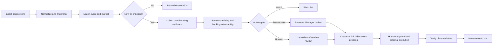

# Event Intelligence — Product and Architecture Proposal

Status: initial foundation live; scalable foundation prepared locally, 2026-09-02. Migration 076 and the authenticated `/market-signals` read model are live. The newer timestamped package (`20260902203000`–`20260902203400`) remains unapplied and adds PredictHQ recovery tracking, CFBD/university registry, governed jurisdictions/markets/localities, primary/secondary listing membership, proposals, provider catalog, recurrence watches, and conditional sports events. No production schema change, Grok connector, pricing/stay-rule write, or notification was enabled by the 2026-09-02 work.

Visual architecture map: [`docs/diagrams/event-signals-data-map.html`](diagrams/event-signals-data-map.html). It distinguishes implemented sources and workflows from the planned official-calendar/news layer, including the academic-date coverage gap.

## Implementation Boundary

The first production-oriented slice now includes:

- permission-protected market, source, event, provider-record, version, evidence, impact, and review tables in `076_market_signals_foundation.sql`;
- five live pilot market centroids with existing coordinate-approved memberships;
- source-independent event fingerprints and event-family keys that do not collapse unknown events to a broad category;
- deterministic date-change, cancellation, action-gate, and evidence-gap logic with unit tests;
- an authenticated, `market_signals:view`-gated queue and market-readiness UI;
- replaceable PredictHQ, Ticketmaster, NWS, and locally prepared CFBD adapters behind one normalized provider contract;
- durable scheduled ingestion, cross-source persistence, PriceLabs vulnerability scoring, human review, and governed Adjustment linking; and
- an optional-schema repository boundary that keeps the live route available before the timestamped package is applied.

Prepared locally after the foundation: a disabled-by-default official university-page adapter and a separate post-foundation configuration migration for the nine UConn, UT Knoxville, and GW registry rows. It has not been merged, deployed, migrated, or activated.

Not yet implemented: approved university source activation and scheduling, a Grok discovery connector, review/activation of the proposed market census, canonical-locality listing backfill, notifications in this release, or any external pricing/stay-rule write.

## Decision

Build a source-agnostic **Market Signals** layer inside RevFactor Hub and use PredictHQ as an optional, replaceable enrichment source during a controlled pilot. Do not purchase full-portfolio coverage or automate pricing changes until the pilot proves incremental lead time, precision, and revenue impact.

The product is not an events calendar. Its job is to turn a verified market change into a reviewable revenue-management action before PriceLabs demand pickup makes the opportunity obvious.

## Business Outcome

For each governed RevFactor market, detect and maintain the lifecycle of demand-changing signals early enough to review:

- ADR and rate premiums;
- minimum stays;
- check-in/check-out restrictions;
- protected floors and existing reservations;
- cancellation, postponement, or severe-weather unwind actions.

Every recommendation remains read-only and human-approved in the initial phases. The system may create or link an Adjustment, but it must not write to PriceLabs, a PMS, or an OTA.

## Two Detection Horizons

### Announcement horizon: 3–24 months

Purpose: catch host-city selections, dates being finalized, venue openings, schedule releases, major conventions, and recurring destination events before ticket inventory or measured demand exists.

Primary evidence:

- official league, city, venue, convention center, tourism bureau, university, and organizer press/RSS/Atom sources;
- market-targeted news search such as GDELT;
- Ticketmaster discovery data after an event becomes ticketed;
- optional PredictHQ `first_seen`, predicted events, and normalized entities.

### Action horizon: 0–120 days

Purpose: decide whether open inventory, current rates, booking pace, and stay rules need review now.

Primary evidence:

- normalized events and change timestamps;
- PredictHQ accommodation impact patterns, suggested radii, local rank, and attendance when licensed;
- National Weather Service alerts for United States markets;
- PriceLabs listing and market snapshots;
- reservations and open-date evidence already available to the Hub;
- event cancellation, postponement, date movement, and source disappearance.

## Source Strategy

| Source | Role | Initial cadence | Strength | Important limit |
|---|---|---:|---|---|
| Official press/RSS/Atom registry | Earliest verified announcements and changes | 30–60 min | Authoritative, long lead | Market-by-market curation |
| Ticketmaster Discovery API | Ticketed concerts, sports, theatre, festivals | 2–6 hr | Free structured venue/event data | Ticketmaster ecosystem only; default quota applies |
| NWS Alerts API | Watches, warnings, advisories, disruption/unwind signals | 5–15 min | Authoritative US weather alerts | US only; negative impact is context-dependent |
| GDELT/news search | Discovery of host-city and schedule announcements | 30–60 min | Broad, early coverage | Must verify against authoritative evidence |
| PredictHQ | Normalized events, attendance, local rank, impact patterns, change metadata | 30–60 min | Strong normalization and enrichment | Commercial coverage; Surge alone misses destination patterns |
| PriceLabs/Hub evidence | Booking vulnerability and current strategy | Existing refresh cadence | Connects the signal to an action | Often confirms demand after the earliest opportunity |

Google News RSS may be tested as a disposable discovery adapter, but it should not be a canonical dependency because there is no stable public integration contract for this use case. Store and verify the publisher URL, not the aggregator URL.

Reference documentation:

- PredictHQ Events, Demand Surge, impact patterns, and Suggested Radius: <https://docs.predicthq.com/api>
- Ticketmaster Discovery API: <https://developer.ticketmaster.com/products-and-docs/apis/discovery-api/v2/>
- National Weather Service API and alerts: <https://www.weather.gov/documentation/services-web-api>
- GDELT DOC/Cloud APIs: <https://docs.gdeltcloud.com/API_DOCUMENTATION_GUIDE>

## Governed Market Registry

Do not use `listings.city` or a fixed 20-mile radius as the operating boundary.

Create reviewed market clusters with:

- stable market ID and display name;
- country code and timezone;
- center point or polygon;
- source-specific radius, starting with PredictHQ Suggested Radius for accommodation when available;
- included listings with distance and manual override reason;
- official sources, venues, entities, and query terms;
- active/inactive state and reviewer.

PriceLabs is the current authoritative source for listing coordinates. Raw location labels require normalization before automated market assignment.

## Signal Lifecycle

Recommended event states:

`candidate → corroborating → verified → review_required → actioned → monitoring → ended`

Exceptional states:

`rejected`, `duplicate`, `postponed`, `canceled`, `unwind_required`, `superseded`.

## Materiality and Action Gates

Use deterministic evidence first. An LLM may extract entities, summarize changes, propose duplicates, and draft the reviewer explanation; it must not invent attendance, choose a price, or bypass the evidence gate.

### Signal materiality

Evaluate:

- source authority and corroboration count;
- whether this is a new announcement, date confirmation, update, postponement, or cancellation;
- event category, predicted attendance, local rank, duration, and accommodation impact days;
- event-to-market distance and source-specific radius;
- local baseline: a large recurring destination event may matter even when it is not a statistical Surge outlier;
- lead time and the market's typical booking window.

### Booking vulnerability

Evaluate by listing and affected date:

- sellable nights and existing reservations;
- current ADR/base/min/max and rate position;
- current listing and market occupancy/pacing;
- current minimum-stay, arrival/departure, orphan-gap, and protected-floor rules;
- last strategy review and last event action;
- data freshness and conflicts.

### Reviewer output

The reviewer receives:

- what changed, when it was first seen, and the evidence links;
- affected market, listings, and accommodation-impact dates;
- current booking/pricing evidence with freshness;
- a bounded proposal such as “review rate premium and 3-night minimum,” never an unsupported automatic percentage;
- risks, contradictory evidence, and the next verification step;
- actions: watch, dismiss with reason, create Adjustment, link existing Adjustment, or escalate.

## Proposed Data Model

Names are provisional. Use permission-based RLS with a new `market_signals` resource; do not add permissive policies.

### Market registry

- `revenue_markets` — reviewed market identity, country, timezone, geometry/radius, lifecycle.
- `revenue_market_listings` — listing membership, distance, assignment source, manual override.
- `revenue_market_sources` — official feed/page/query registry, cadence, trust tier, last success.
- `revenue_market_entities` — leagues, venues, organizers, teams, universities, destination terms.

### Normalized events and evidence

- `market_events` — canonical event identity, title, category, dates, state, geometry, first/last seen.
- `market_event_provider_records` — provider/external ID, source URL, source timestamps, normalized fields, content hash, license-retention metadata.
- `market_event_versions` — immutable before/after change summary and detected-at timestamp.
- `market_event_evidence` — authoritative/news evidence URL, publisher, publication time, extraction confidence, verification state.
- `market_event_impacts` — market/event join with impact dates, score components, radius/distance, attendance/rank where licensed.

### Review and outcome

- `market_signal_reviews` — reviewer state, explanation, evidence snapshot, data freshness, decision, reason.
- `market_signal_listing_impacts` — per-listing affected dates and vulnerability evidence.
- `market_signal_adjustments` — link to existing Adjustments; no duplicate mutation workflow.
- `market_signal_outcomes` — action timestamp, observed rate/stay-rule state, pickup/ADR evidence, counterfactual label, review notes.

Retain normalized fields and provider IDs according to each source license. Avoid storing unrestricted raw payloads by default.

## Hub Placement

Phase 1 should be a new authenticated `/market-signals` route gated by `market_signals:view`, because the existing Revenue Manager route is still a read-only fixture and migration 075 is unapplied.

The route should provide:

- **Needs review** — verified, material signals with vulnerable dates;
- **New announcements** — long-lead candidates waiting for corroboration or dates;
- **Changed/canceled** — unwind queue;
- **Watchlist** — monitored signals below the action threshold;
- market filters and an evidence-rich detail drawer/modal;
- create/link Adjustment action with immutable signal evidence attached.

Later, expose the same read model as a Signals tab in Revenue Manager. Keep execution governed by Revenue Manager/Adjustment permissions and verification rules rather than adding a second pricing-control path.

## Scheduling and Operations

The existing daily Vercel cron is not fast enough for announcement/change monitoring. Use one of:

1. Supabase scheduled Edge Functions/`pg_cron` orchestration with secrets stored server-side; or
2. Vercel Pro cron/queue infrastructure for 15–60 minute adapters.

Each source adapter must be independently observable and retryable. Store cursor/high-water timestamps, rate-limit state, last success, last error, rows read, rows changed, and dedupe counts. A source failure must degrade to visible stale evidence, not a silent empty feed.

## Pilot

Use Washington, DC; Tucson; Myrtle Beach; Park City; and the Gatlinburg/Smokies cluster. They cover dense urban, university, coastal destination, ski/destination, and cabin/destination behavior.

Run in read-only shadow mode for at least 30 days, with backtesting when licensed data permits.

### Primary pilot metrics

- verified major-event recall against a reviewed market calendar;
- alert precision: share of review alerts judged materially actionable;
- incremental lead time versus the first PriceLabs/booking-pickup trigger;
- median time from verified alert to reviewer decision;
- recommendation acceptance and dismissal reasons;
- cancellation/postponement detection time;
- affected-date revenue-at-risk and captured uplift, labeled observational unless a defensible counterfactual exists.

### Go/no-go gate for a PredictHQ purchase

Buy only where PredictHQ produces decision-changing incremental coverage or materially reduces analyst effort after subtracting overlap with official sources, Ticketmaster, NWS, news monitoring, and PriceLabs.

## Delivery Plan

### Phase 0 — benchmark harness

- Normalize PriceLabs coordinates into reviewed pilot markets.
- Persist aggregate source pulls outside production decision tables.
- Create a reviewed golden calendar for the five markets.
- Benchmark PredictHQ Events versus Surge, Ticketmaster, official sources, and news discovery.

### Phase 1 — read-only Market Signals

- Implement source adapters, normalized event/version tables, dedupe, evidence, and market matching.
- Build Needs Review/New/Changed/Watchlist UI.
- Add Hub tasks/Adjustments linking; no external mutations.

### Phase 2 — booking-vulnerability evidence

- Join listing snapshots, reservations, open inventory, and current stay-rule evidence.
- Add deterministic action gates and reviewer proposals.
- Measure analyst time, lead time, precision, and outcomes.

### Phase 3 — controlled execution integration

- Only after governance and outcome evidence are strong, attach approved recommendations to the persisted Revenue Manager flow.
- Preserve explicit approval, before/after state, verification, and rollback/unwind behavior.

## Open Questions

- What volume discount and minimum commitment will PredictHQ quote for a five-market or cluster-based pilot?
- What are the retention, display, and derivative-data rights for each paid source?
- Which official sources and venues define the golden calendar in each pilot market?
- What threshold qualifies as “actionable” for each market type and booking window?
- Which data source can reliably show current minimum-stay and check-in/check-out restrictions at date grain?
- Should the first alert channel be Hub-only, email, Slack, or Assembly/WhatsApp after reviewer confirmation?
