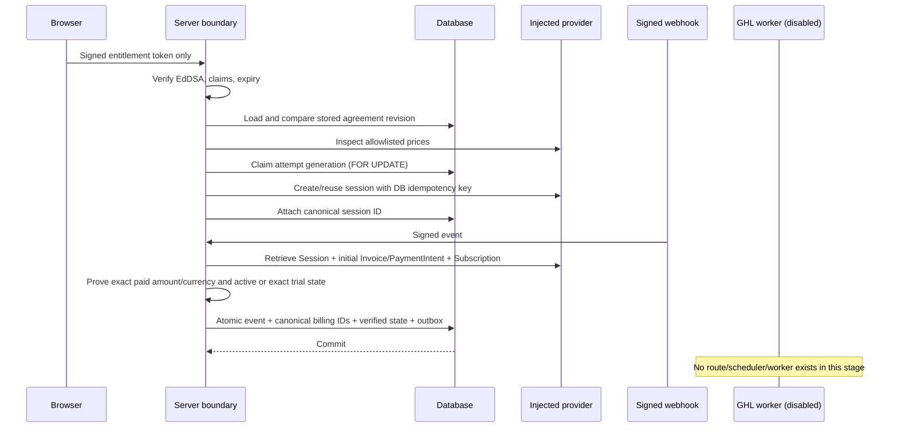

# RF-AUTO-001 — Server Checkout Boundary (Draft/Test Review)

Status: **Draft/Test only; migration `20260903190000_server_checkout_boundary.sql` is unapplied; no route, worker, provider client, or feature flag is enabled.**

This slice replaces the unsafe authority model of the existing draft checkout bridge. Browser/GHL values do not select prices or quantities. A short-lived Ed25519-signed entitlement identifies one exact agreement revision; the server compares every commercial claim to its stored record, resolves a versioned allowlisted price book, and lets the database own attempt generations and provider-event replay.

Federico approved the four commercial policies on 2026-08-27: the one-time fee is $150; scheduled service collects that fee at checkout and begins recurring billing on the signed service-start date; immediate service includes the first month; quantity changes require a revised and re-signed agreement; tax stays `policy_blocked` pending professional determination; and Federico is the initial sole exception approver. The implementation remains Draft/Test and unwired until a later scope promotes these policies from provisional fixtures. See [RF-AUTO-001_FEDE_COMMERCIAL_DECISIONS.md](./RF-AUTO-001_FEDE_COMMERCIAL_DECISIONS.md).

## Architecture

```mermaid
flowchart LR
  GHL[GHL agreement and intake] -->|signed agreement revision| ISSUER[Entitlement issuer]
  ISSUER -->|EdDSA JWS, max 15 min| CHECKOUT[Server checkout boundary]
  BROWSER[Browser] -->|signed token only| CHECKOUT
  CHECKOUT -->|compare all claims| ENT[(Agreement entitlement ledger)]
  CHECKOUT -->|resolve version| BOOK[Server price-book allowlist]
  BOOK -->|inspect exact account, mode, product, amount, cadence| STRIPEAPI[Injected provider adapter]
  CHECKOUT -->|claim generation under row lock| ATTEMPT[(Checkout attempt ledger)]
  STRIPEAPI -->|session IDs only| ATTEMPT
  WEBHOOK[Signed provider webhook] -->|retrieve canonical provider objects| RECON[Reconciliation service]
  RECON -->|one atomic transaction| EVENT[(Provider event ledger)]
  RECON --> ATTEMPT
  RECON --> OUTBOX[(GHL sync outbox)]
  OUTBOX -. worker deliberately absent .-> GHL
  ATTEMPT -->|payment is necessary, not sufficient| FINAL[Final GHL onboarding submitted]
  FINAL -->|guarded idempotent candidate| ASSEMBLY[Assembly handoff]
```

## Process and commit boundary

## Legal checkout states

| State family | States | Allowed purpose |
|---|---|---|
| Policy | `policy_blocked`, `eligible` | Fail closed until policy permits a claim. |
| Session | `session_creating`, `session_open`, `session_expired`, `superseded`, `cancelled` | One active generation per agreement entitlement; safe replacement only when no canonical payment IDs exist. |
| Provider verification | `checkout_completed_unverified`, `provider_reconciling`, `payment_verified`, `payment_verified_scheduled`, `payment_failed` | A checkout callback is not payment truth; signed webhook plus canonical object retrieval is required. |
| GHL and billing | `ghl_sync_pending`, `ghl_onboarding_unlocked`, `service_billing_active`, `service_billing_failed` | Outbox-based GHL projection and explicit service-billing state. |
| Owned exceptions | `identity_conflict`, `provider_conflict`, `manual_review`, `revoked` | Human-owned terminal/review paths; never automatic Assembly handoff. |

Transitions are duplicated intentionally in TypeScript and the server-checkout migration. Tests check the application reducer, while the database function rejects transitions not present in the locked transition table.

## Authority and replay guarantees

- The checkout function accepts only `entitlementToken` from the browser. There are no browser price, quantity, account, fee, cadence, or tax parameters.
- The entitlement signature is EdDSA; header algorithm/type/key ID, audience, issuer, maximum lifetime, not-before, expiry, agreement hash/revision, quantities, service start, currency, price-book version, and tax policy are validated.
- Signed fields are then compared one-for-one with `agreement_entitlements`; a valid token with stale or conflicting stored state fails.
- Token, stored entitlement, price book, provider adapter, signed event, and retrieved objects must all match the same environment and Stripe account. An `isolated_fixture` requires a `fixture:*` account and cannot invoke a Test/Live adapter.
- The provider price inspection must match the allowlisted Stripe account, environment/live mode, active state, product marker, amount, currency, one-time/recurring kind, and monthly cadence.
- `claim_server_checkout_attempt` locks the entitlement row, returns an existing active generation, and creates a replacement generation only from bounded safe states with no payment/subscription IDs.
- The one canonical line-item shape is `{ priceId, quantity, kind, unitAmount, currency }`, sorted by price ID from server claim through provider retrieval and SQL comparison.
- `no_payment_required` is rejected. Scheduled service requires a paid $150 initial Invoice, its succeeded PaymentIntent, the Subscription latest-invoice identity, `trialing`, and the exact noon-UTC epoch of the signed service-start date. Immediate service requires the paid `$150 + first month` Invoice/PaymentIntent, `active`, and no trial.
- Provider events are serialized and unique by provider event ID. Successful reconciliation, canonical customer/subscription/initial-Invoice/PaymentIntent IDs, verified state, and the GHL outbox insert commit atomically.
- Correctly signed conflicts and unknown/out-of-order events are stored once with an allowlisted error code and a redacted observation capped at 4 KB. They create no GHL outbox row and known attempts fail closed in `provider_conflict`.
- The webhook reconciliation module imports no GHL or Assembly client. It cannot perform an external action before database commit.
- The checkout migration adds the Assembly handoff outbox and its guard trigger on top of the canonical migration tip. It requires the current active agreement revision, matching GHL contact/run identity, no exception/conflict, final submitted GHL onboarding, approved commercial state, and the run-stable key `rf.onboarding.v1:<run_id>`. The later multi-business migration strengthens this to require every billing account in the group.

## RLS and grants

All six new tables enable RLS. Authenticated users receive SELECT only and only `super_admin` passes the policy. `anon` and `authenticated` receive no writes. The service role receives the minimum table rights and exclusive execute rights on claim, attach, transition, expected-state lookup, reconciliation, and conflict-audit functions. Every SECURITY DEFINER function fixes `search_path = public`. Separate triggers enforce checkout transitions, service-billing transitions, immutable issued commercial fields, immutable attempt authority fields, and the final Assembly predicate.

## Executed disposable migration rehearsal

`scripts/rehearse-server-checkout-migration.sh` starts PostgreSQL in a new `mktemp` cluster with socket-only networking, applies the canonical base plus checkout and multi-business migrations, verifies transactional rollback, runs assertions, then drops and rebuilds the database and repeats the full sequence. The cluster is stopped and deleted on exit.

The executed rehearsal passed: canonical base → checkout → multi-business forward, transactional rollback, forward-again, 20 concurrent claims returning one attempt/generation, account isolation, exact group-fee allocation, RLS/grants/function signatures, agreement/attempt/account immutability, service-billing transitions, GHL outbox atomicity, and the all-accounts Assembly gate. `supabase/rehearsal/087_prerequisites.sql` contains disposable schema stubs only.

## Deliberate limitations

- No public route wires these services.
- No real Stripe adapter or test/live Stripe resource is present.
- The inert server price-book loader names five future server-only variables (`RF_CHECKOUT_STRIPE_ACCOUNT_ID`, `RF_CHECKOUT_STRIPE_MODE`, and the three `RF_CHECKOUT_V1_*_PRICE_ID` values); none is configured or read by a route in this stage.
- Neither new migration has been applied outside the disposable temporary PostgreSQL clusters described above.
- No GHL outbox worker exists; `GHL_CHECKOUT_SYNC_WORKER_ENABLED` is `false`.
- No GHL/Assembly production effect, message, agreement, domain, workflow, card, subscription, invoice, or AI action is included.
- Tax policy and immediate-versus-scheduled commercial policy remain Federico decisions before any integration stage.
