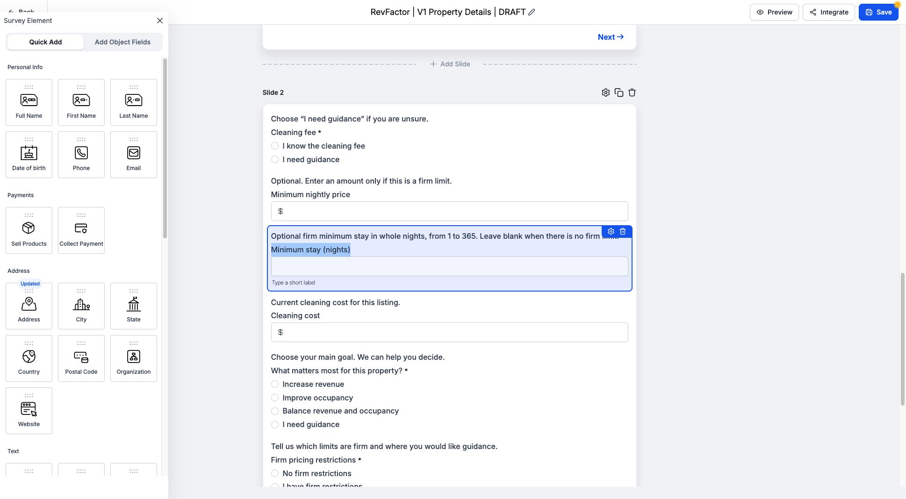
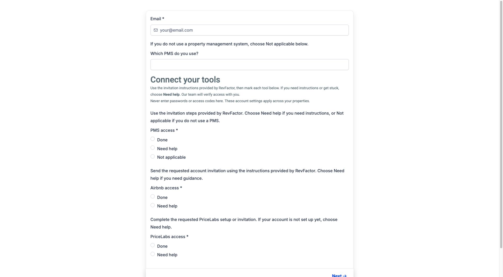

# Native GHL draft review snapshot — 2026-09-04

These are reviewable source snapshots of the new native GHL assets. They are not installed adapters or live client entry points. The live GHL records remain authoritative for provider state; the dedicated GHL workspace holds the full implementation log.

| Draft | Native survey ID |
|---|---|
| Property review and essential preferences | `VvcWqrwmq7wESZSfFBme` |
| Software setup and explicit final review | `CfTInIn60HazWmPD1Zf9` |

The property draft uses one minimum-stay field. Saved preferences, identity and account setup have explicit prefill mappings; review/confirmation choices are never silently checked. Need-help answers do not require invented values.

Same-document custom JavaScript execution was verified in the native survey with a detached synthetic submit event. This proves a feasible place to run the adapter. It does not prove real GHL submit ordering, framework state persistence, property upsert, contact association or resume. Those remain required pilot checks.

Run local adapter checks with `node docs/ghl/native-v1/native-property-adapter.test.mjs` and `node docs/ghl/native-v1/native-account-adapter.test.mjs`.

The existing commercial templates and published workflows were preserved. Use [the rollout runbook](../onboarding-v1-runbook.md) and [the implementation plan](../../../PROJECT-PLAN.md) before wiring any entry link, script, payment or invitation.

## Property draft

## Software draft

The software guide still needs the validated account-invitation instructions/destinations before launch; this screenshot is a checklist draft, not a complete setup guide. Native required email must be securely prefilled and reviewed during the pilot.
