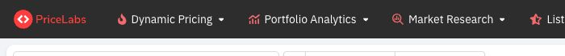
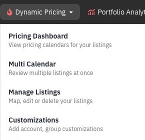
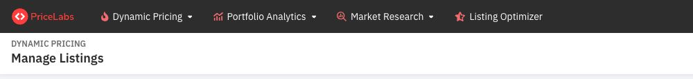
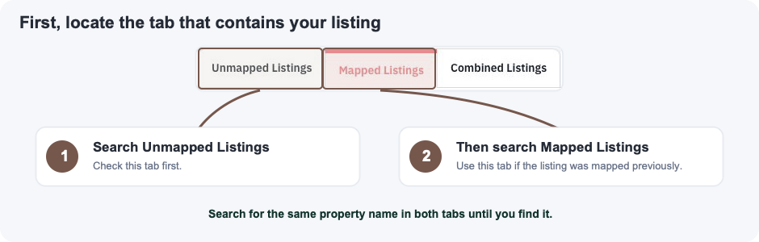
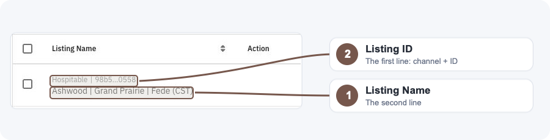
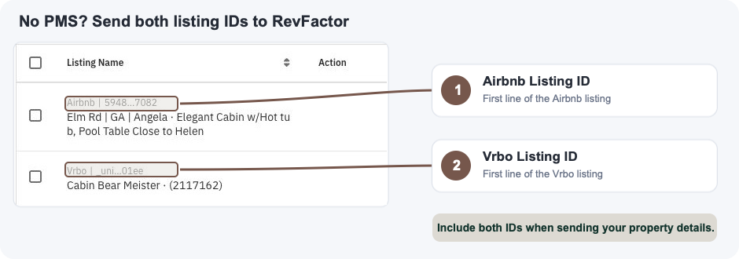

# How to Find Your PriceLabs Listing ID

Use these steps to locate the listing ID RevFactor needs from your PriceLabs account.

## 1. Open Manage Listings

From the page you see after signing in, select **Dynamic Pricing** in the top navigation.

In the dropdown, select **Manage Listings**.

You should now see the **Manage Listings** page.

## 2. Locate your listing

Listings can appear under either **Unmapped Listings** or **Mapped Listings**.

1. Open **Unmapped Listings**, enter the property name in the search box, and look for the listing.
2. If you do not find it, open **Mapped Listings** and search for the same property name again.

If you mapped the listing previously, its listing ID will be under **Mapped Listings**.

## 3. Find your listing information

### If your listing is connected through a PMS

Use the search box to find the property you want to share with RevFactor. The example below searches for **Ashwood**.

In the **Listing Name** box:

1. **Listing Name** is shown on the second line.
2. **Listing ID** is shown on the first line, immediately after the channel name.

Send RevFactor both the listing name and the channel/listing ID shown in this box.

### If you do not use a PMS

If you connected Airbnb and Vrbo directly to PriceLabs, the same property can appear as two channel-specific listings. Search for the property and locate both rows.

1. Find the **Airbnb Listing ID** on the first line of the Airbnb row.
2. Find the **Vrbo Listing ID** on the first line of the Vrbo row.

Send RevFactor both listing IDs. The property names on the second lines help confirm that you selected the correct listings.

If the Airbnb and Vrbo listings were mapped previously, PriceLabs may label one row **PARENT** and the other **CHILD** under **Mapped Listings**. Send the channel/listing ID from the first line of both rows.
