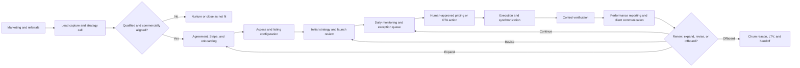

# RevFactor Chief of Staff Brief

> Comprehensive business and operating-system review for onboarding a Chief of Staff or a new internal AI assistant.
>
> Version 0.1 · 2026-08-18 · Internal and confidential

## Executive Summary

**RevFactor is a managed revenue-management company for short-term-rental owners and small portfolio operators.** Clients hire RevFactor to operate the commercial layer of their listings: market positioning, demand forecasting, dynamic pricing, minimum-stay and gap rules, promotions, event strategy, OTA merchandising, and performance interpretation. The service is done for the client rather than sold as self-serve pricing software. PriceLabs is the core pricing engine, while RevFactor contributes listing-specific judgment, oversight, client communication, and controlled execution.

**The core customer needs professional pricing judgment but is not large enough to employ a full-time revenue manager.** RevFactor also prices every Blackbird-managed listing, making Blackbird both a sister company and an internal proof environment. The company charges a flat recurring fee per property, generally discounted by portfolio size, instead of taking a percentage of property revenue.

Flight Deck describes RevFactor as launched around June 2025 and records a public positioning claim of more than 165 properties across approximately 24 states and 56 markets, with an 18% RevPAR lift versus the relevant comp set. Those are marketing claims and should be revalidated before reuse. A Flight Deck enterprise-value model seeded on 2026-07-24 estimates approximately $46,000 in MRR, 80 active clients, $558,000 annualized revenue, a 50% EBITDA margin, 40% revenue growth, 75% retention, and LTV:CAC of 4. The model explicitly labels these as estimates or “gut numbers,” so they are a starting hypothesis—not an audited operating baseline.

**RevFactor's strongest asset is its domain expertise; its primary constraint is key-person dependency.** Federico's airline revenue-management background, Gaston's operating knowledge, real STR experience through Blackbird, and an increasingly capable internal data platform create differentiation. Scaling requires converting judgment into governed playbooks and exception queues—not fully autonomous pricing. Systems should observe, calculate, prioritize, draft, and verify; humans remain accountable for strategy, material tradeoffs, approvals, and external promises.

**The Chief of Staff should treat RevFactor as both a service business and an operating-system build.** The mandate is to make the business legible and repeatable: maintain the company scorecard, reconcile commercial terms, clarify decision rights, drive onboarding and service SLAs, close cross-functional loops, reduce key-person dependency, and ensure product experiments do not distract from the reliability of the managed service.

## Purpose and Evidence Standard

This document explains what RevFactor is, how the company makes money, how the service is delivered, which systems support it, where the major constraints sit, and what a Chief of Staff should monitor. It synthesizes the current RevFactor Hub repository, the private Flight Deck business vault, and the Flight Deck executive dashboard application.

It is an orientation document, not a substitute for live systems. Revenue, client, listing, pricing, retention, and margin figures should be refreshed from Stripe, RevFactor Hub, and Flight Deck before they are quoted or used for a decision.

The sources contain facts with different levels of reliability. This brief uses the following hierarchy:

1. **Implemented current state** — behavior visible in current Hub or Flight Deck code and durable architecture documentation.
2. **Recorded business decision** — a dated decision or meeting outcome in Flight Deck; authoritative when it has not been superseded, but its implementation may still need confirmation.
3. **Estimate or historical snapshot** — a number explicitly labeled as an estimate, a public marketing claim, or a commercial term quoted in a specific sales conversation.
4. **Recommended control** — a proposed management practice in this brief; useful direction, but not an existing company commitment unless adopted.

When sources disagree, this document preserves the disagreement instead of silently choosing one value.

---

## 1. What RevFactor is—and is not

### The core business

RevFactor is a high-touch, done-for-you revenue-management consultancy for short-term rentals. It typically receives appropriate co-host, PMS, and PriceLabs access, then manages revenue strategy on the client's behalf.

The service includes:

- Annual and seasonal pricing architecture.
- Daily price and restriction optimization.
- New-listing launch strategy.
- Market and competitive-set analysis.
- Event and compression-date forecasting.
- Minimum-stay, orphan-gap, arrival, departure, and booking-window rules.
- Promotions, discounts, channel markups, and target-payout logic.
- Far-out pricing protection.
- Parent-and-child listing strategy where the property configuration supports it.
- OTA listing and conversion review.
- Pacing, pickup, occupancy, ADR, RevPAR, and market-index interpretation.
- Client-request triage and controlled pricing adjustments.
- Reporting and client-facing explanations.

### What RevFactor is not

- It is not currently a self-serve dynamic-pricing application.
- It is not full-service property management; Blackbird fills that role for its own clients.
- It does not own guest operations, cleaning, maintenance, or general property operations for outside RevFactor clients.
- It does not promise a particular ranking, booking, occupancy, revenue, or investment outcome.
- The Hub is primarily an internal operations platform, not a general client portal. Its public adjustment card exposes only deliberately non-sensitive fields.
- The current governed agent environment is a read-only analysis and drafting system. It does not autonomously change PriceLabs, mutate client data, or send external messages.

### The underlying job to be done

The customer is not primarily buying “better numbers in PriceLabs.” The customer is buying professional commercial judgment without hiring an in-house revenue manager. The job includes deciding when to trust the pricing engine, when to override it, how to reconcile owner goals with market evidence, and how to explain performance without hiding behind generic market commentary.

---

## 2. Customer and market

### Ideal customer profile

The strongest fit is generally:

- A self-managing STR owner or small portfolio operator.
- One or more active or soon-to-launch properties.
- Enough revenue opportunity that a monthly management fee is economically rational.
- Willingness to grant the required PMS, Airbnb/co-host, and PriceLabs access.
- Openness to data-based tradeoffs among ADR, occupancy, RevPAR, turnover cost, and owner constraints.
- A property whose results can be influenced through pricing, availability, merchandising, and distribution—not one whose core issue is fundamentally operational or physical.

Relevant segments include first-time STR investors, remote owners, sophisticated owners adding a new market, and operators with larger or unusual properties that require more than default pricing rules.

### Common customer problems

- The owner has PriceLabs but does not know whether its rules fit the listing.
- The property fills too early at low rates or holds too high and misses demand.
- Last-minute gaps, one-night openings, or minimum-stay rules make inventory difficult to sell.
- Large properties require earlier booking windows and stronger far-out price protection.
- New listings need a deliberate conversion and ranking strategy during their launch window.
- OTA discounts and channel markups are misunderstood.
- The listing attracts views but converts poorly because of merchandising, guest-count positioning, fees, restrictions, or property-product mismatch.
- Owners optimize emotionally around ADR even when RevPAR or contribution economics point elsewhere.
- Performance questions arrive without an aligned date range, benchmark, or definition.

### Poor-fit or escalation cases

Pricing cannot repair every business problem. A property can be structurally mispositioned, operationally weak, over-leveraged, poorly merchandised, restricted by its physical layout, or burdened by unrealistic owner expectations. RevFactor should be willing to diagnose a fit problem, recommend a non-pricing intervention, or offboard a persistently poor-fit relationship.

The current churn taxonomy in the Hub recognizes price/cost, results/performance, property sale, exit from STR, self-management, competitor switch, contract non-renewal, service/communication issue, non-payment, and other reasons. The Chief of Staff should turn that taxonomy into a recurring retention analysis rather than use it only as an offboarding form.

---

## 3. Offer and revenue model

### Managed revenue management

The recorded business model is a flat monthly fee per property, volume-discounted, with a one-time onboarding charge. RevFactor does not take a percentage of property revenue.

Flight Deck records the following indicative price architecture:

| Portfolio size | Indicative monthly price | Evidence status |
|---|---:|---|
| 1 property | About $320 | Flight Deck business summary and historical discovery call |
| 2 properties | About $304 each | Flight Deck business summary; described as about 5% off |
| 5+ properties | About $256 each | Flight Deck business summary; described as about 20% off |
| Child listing | Historical example of +$35/month | One June 2026 discovery-call quote |
| Onboarding | $125 or $150 one time | Current Hub checkout defaults to editable $125; historical calls used $150 |
| Initial term | Historical example: 3-month minimum, then month-to-month | Recorded in June 2026 discovery calls; confirm current contract |

These values are not yet a clean source of truth. The price card, sales quotes, Stripe products, child-listing treatment, onboarding fee, discounts, and contract term must be reconciled into one approved price book.

PriceLabs and Rankbreeze have historically been described as included in the managed service. That increases customer value but makes software cost per listing part of RevFactor's delivery margin and capacity economics.

### Emerging product portfolio

A recorded June 2026 decision defines three potential offer families:

1. **Revenue Management** — the core done-for-you managed service.
2. **RevFactorCFO** — a self-serve financial command center for STR operators.
3. **Education** — on-demand learning and a possible cohort/community tier.

Flight Deck describes draft RevFactorCFO tiers of $29 Starter, $79 Pro, and $199 Portfolio per month, with property overages and a 14-day no-card trial. It also records a historical target of the first paying customer around mid-2026. Because that date has passed and this review did not verify a production launch, current product status, customer count, pricing, and ownership are open questions.

The education concept included an on-demand path and a community concept of 10 seats at approximately $5,000 for six months, with monthly live sessions. It is a recorded product idea, not evidence of a launched offer.

### Economic characteristics

The managed service has several attractive traits:

- Recurring subscription revenue.
- Flat-fee pricing that is simple for clients.
- Low customer concentration in the Flight Deck estimate.
- Historically referral- and content-led acquisition, implying low paid CAC.
- Potentially strong gross margin once review and execution are standardized.
- Cross-sell potential among managed RM, the CFO product, and education.

The main economic tension is that flat per-property pricing can hide large differences in complexity. A simple one-bedroom listing and a multi-unit, event-sensitive compound may pay similar headline rates while consuming very different strategy, communication, and control time. A capacity model by listing complexity and client service load is therefore essential.

---

## 4. Revenue-management doctrine

### North-star performance logic

RevFactor should optimize the client's economic outcome, not one isolated metric. ADR, occupancy, and revenue must be read together; RevPAR is often the better commercial comparison, while contribution and owner cash goals may be more important than gross revenue.

Every property-specific metric must carry a comparison contract:

- Property or portfolio scope.
- Stay date range and data grain.
- Source.
- Benchmark.
- As-of date.
- Whether the comparison is current pace, same-time-last-year pace, final last year, market, or explicit target.

Pickup is not the same as pace. Same-time-last-year pace is not final last-year performance. A calendar-month average is not an exact rolling 90-day calculation. A metric describes an observed result; it does not by itself prove why that result occurred.

### Listing-specific strategy

RevFactor does not impose one universal pricing or minimum-stay policy. Strategy should account for:

- Owner goals and risk tolerance.
- Property type, bedroom count, guest capacity, and amenities.
- Market seasonality and booking window.
- Existing bookings and open-gap shape.
- Day of week and event behavior.
- Turnover cost and operational constraints.
- Channel economics and discounts.
- Parent/child listing relationships.
- Historical performance and market evidence.

### New-listing launch

A recorded strategy applies a 20% base-price markup from day one, drops it to 10% after 30 days, and accepts Airbnb's automatic 20% new-listing discount. The intent is to protect economics while using the initial conversion window. This is a documented strategy, but a Chief of Staff should ensure the current playbook defines when the rule applies, who approves exceptions, and how launch results are reviewed.

### Far-out pricing

Large properties can book beyond the standard 365-day pricing window. RevFactor recorded a policy for large listings—especially five or more bedrooms—to avoid rates falling below prior-year equivalents and to add an approximate premium buffer using custom seasonal profiles. The underlying risk is rule-window expiration: as dates move into a default window, a generic rule can unintentionally replace a premium far-out setup.

### Minimum stays and calendar behavior

Minimum stays are owner- and listing-specific. A booking, cancellation, or alteration can change an open gap and therefore which PriceLabs rule should apply. Until PriceLabs recalculates and synchronizes the newly applicable rule, inventory can appear open but remain unbookable. Diagnosis must distinguish blocked inventory, open inventory, and open-but-restricted inventory, then verify PriceLabs, PMS, and OTA state.

### OTA discounts and markups

Discounts should be explained from the channel-specific marked-up rate, not as a direct reduction from the PriceLabs target. The Hub's governed policy uses an example rate flow to illustrate this, but explicitly rejects treating one markup percentage as universal. Client communication must distinguish nightly reference rate, accommodation subtotal, channel promotion, fees, taxes, guest total, and host payout.

### Conversion and listing quality

Pricing is only one stage of the booking funnel:

1. Positioning and search visibility.
2. Click-through rate.
3. Booking conversion.

High views and clicks with poor booking conversion can point to guest-count positioning, merchandising, restrictions, fees, cancellation terms, property mismatch, or listing copy—not necessarily rate alone. RevFactor's listing-review work has included pet policy, copy structure, amenity presentation, and competitive-substitution analysis.

---

## 5. The end-to-end operating model

### 5.1 Demand generation and sales

The historical flow runs from the RevFactor marketing site to a strategy-call scheduler, then into the Hub pipeline. The scheduler sends confirmed bookings to the Hub through a webhook. Landing-page leads can also enter through a separate webhook with attribution fields.

GoHighLevel is intended to become the primary system for lead capture, booking, reminders, no-show follow-up, nurture, and sales-stage movement. The Hub should mirror relevant lifecycle events for internal reporting rather than compete as a second sales CRM. As of the current integration notes, the GHL pipeline and fields exist, but calendar setup and the Hub lifecycle receiver remain incomplete.

The sales motion should qualify at least:

- Property and market.
- Number of parent and child listings.
- Current PMS, OTAs, and pricing setup.
- Launch or service-start timing.
- Owner goals and constraints.
- Revenue opportunity and service fit.
- Access readiness.
- Commercial terms and referral source.

### 5.2 Contracting and payment

Stripe is the source of truth for active subscriptions and invoices. The Hub links Stripe customers to clients and listings to subscriptions. It can create a customer, select an active recurring price, add an editable onboarding charge, and generate a Checkout Session.

Client billing in the Hub is derived from current Stripe subscriptions rather than the legacy manual billing field. Daily Stripe synchronization mirrors subscriptions, invoices, payouts, and relevant payout transactions. The Chief of Staff should distinguish contracted recurring revenue, invoiced revenue, collected cash, Stripe payout timing, and bank-settled cash.

### 5.3 Onboarding

Onboarding requires the customer, sales team, revenue team, and systems to align. Typical inputs include:

- Signed agreement and successful payment setup.
- Client and listing records in the Hub.
- PMS or channel access.
- Airbnb co-host or equivalent access where required.
- PriceLabs ownership or account transition.
- Intake form with goals, floors, restrictions, and operational constraints.
- Listing and channel mapping.
- Initial market and comp review.
- Pricing-rule configuration.
- First strategy review and launch communication.

The Hub contains a legacy client-level onboarding UI and a newer run-based onboarding contract used by a separate Assembly onboarding app. This split is a process risk: the Chief of Staff should identify which surface is authoritative for every onboarding stage and eliminate double entry or invisible handoffs.

### 5.4 Daily revenue operations

The intended operating loop is:

> Observe → diagnose → prioritize → propose → approve → execute → verify → explain → learn

Signals come from PriceLabs snapshots, Report Builder, reservation data, market/event context, owner requests, Assembly messages, OTA state, and the governed Knowledge base. Work should be prioritized by expected revenue impact, urgency, confidence, and effort—not merely by which client messaged most recently.

### 5.5 Adjustments and change control

The Hub's Adjustments module is the clearest operational control system. It supports pricing, minimum stay, price floor/ceiling, target payout, check-in/out, discounts, markups/fees, availability, setup, review, recommendations, and other change types.

The lifecycle separates a proposed or active change from verified completion:

- `open` — intake or proposal pending review.
- `in_progress` — approved and being worked.
- `needs_info` — blocked on required context.
- `resolved` — applied by the operator, awaiting control.
- `controlled` — independently verified.
- `issue` — execution or synchronization problem.
- `rejected` — declined with a recorded reason.

HostPricing-origin requests start as proposals and cannot bypass internal approval. External pricing partners can view, create, and edit adjustments but do not have control or deletion authority. The `resolved → controlled` transition is deliberately permission-gated.

### 5.6 Client communication

Recorded operating guidance emphasizes acknowledging client messages quickly even when the answer will take longer, grounding the response in data, setting a review point, and showing evidence after a change. The exact service-level targets are not yet codified in the reviewed sources.

Assembly is a primary client-communication and portal surface. The Hub stores Assembly links and can read sanitized Assembly history for agent testing. The current agent architecture cannot send to Assembly. Drafts remain internal until a separately approved send architecture exists.

### 5.7 Reporting and renewal

The reporting layer combines listing snapshots, monthly Report Builder metrics, reservation exports, and client-facing dashboard links. It supports occupancy, ADR, RevPAR, market comparisons, STLY/LY context, pickup, revenue on books, and forward outlook.

Renewal should evaluate both client outcomes and service economics. A client can show acceptable revenue performance but still be operationally unprofitable for RevFactor because of communication load, repeated exceptions, poor access hygiene, or excessive manual work. Conversely, a lower-revenue listing can remain a healthy client if it is simple to manage and strategically aligned.

---

## 6. People, roles, and decision rights

The current sources name a small core team plus external or adjacent contributors. Titles and present-day employment status should be confirmed before this section is treated as an org chart.

| Person or group | Observed responsibility | Decision boundary to preserve |
|---|---|---|
| Federico | Founder, revenue strategy, high-risk decisions, product/system direction, sales involvement | Owns company direction, material commercial exceptions, major policy, and sensitive escalations |
| Gaston | Partner/revenue manager; day-to-day pricing, strategy, reporting, client and vendor coordination | Owns revenue-operation quality and implementation within approved policy |
| Andres | Pricing and listing-review support in June 2026 records | Confirm current role and portfolio ownership |
| HostPricing team | External pricing proposals and execution support | May propose/apply within scope; internal RevFactor retains approval and control |
| Sales/support participants | Strategy calls, scheduling, follow-up, and onboarding handoff | Confirm current names, ownership, incentives, and CRM responsibilities |
| Chief of Staff | Cross-functional operating cadence, scorecard, accountability, capacity planning, risk and decision follow-through | Coordinates and escalates; does not invent pricing policy or override domain owners |

### Recommended accountability design

Even if several responsibilities sit with one person today, RevFactor should distinguish these accountabilities:

- **Portfolio Strategist** — owner goals, listing fit, long-term strategy, material tradeoffs.
- **Demand and Forecasting Analyst** — forecasts, pacing, scenario analysis, variance.
- **Pricing and Inventory Manager** — rates, restrictions, gaps, promotions, event actions.
- **Distribution and Conversion Manager** — OTA merchandising, channel setup, fees, discounts, conversion.
- **Revenue Operations Controller** — access, data quality, approved-change verification, audit trail.
- **Client Strategy Partner** — communication, approvals, expectation management, retention.
- **Chief of Staff** — company scorecard, resource allocation, operating cadence, unresolved dependencies, strategic project sequencing.

At current scale, these are accountabilities—not necessarily separate hires.

---

## 7. Systems and sources of truth

### RevFactor Hub

`hub.revfactor.io` is the internal operating system. Phase 1 was explicitly designed for approximately two to three internal users rather than broad client access, and it currently contains:

- Dashboard and portfolio pacing.
- Clients and listings.
- Reservations and exports.
- Tasks and roadmap projects.
- Sales pipeline.
- Onboarding.
- Adjustments and change control.
- Financials, expenses, Profit First planning, and bank reconciliation.
- Knowledge, credentials, Agent Studio, and governed Agent Flows.
- Permissions and role configuration.

Supabase PostgreSQL is the primary Hub datastore. The application uses permission-based row-level security, with financial fields additionally gated to `super_admin`.

### PriceLabs and Report Builder

PriceLabs is the core pricing and performance source. The Hub uses two distinct analytical views:

- Synced listing snapshots for exact forward 7/30/90-day occupancy and market occupancy.
- Report Builder for monthly current, market, same-time-last-year, and final-last-year comparisons.

The distinction is important. The monthly grid should not be relabeled as an exact rolling calculation.

### Reservation data

Reservation-level data arrives through an externally managed BigQuery → Supabase wrapper pipeline. The application reads a local materialized cache because querying the foreign table directly is slow and permission-constrained. The upstream source refreshes daily around 02:20 UTC, and the local cache refreshes hourly. “Current” reservation reporting therefore carries inherent latency.

### Stripe and Relay

Stripe is the source for subscriptions, invoices, and payout batches. Relay CSV imports provide bank-side evidence for deposits, transfers, and actual expenses. Stripe activity should not be confused with bank-settled cash, and internal transfers should never be counted as income or expense twice.

The Hub's Profit First model allocates each payout as 30% Partner A, 30% Partner B, 15% tax, and the exact remaining 25% to OPEX. This is an implemented internal financial rule and should only be changed through an explicit financial decision.

### Assembly

Assembly is a client-portal and communication surface. Client records link to Assembly, and sanitized read-only history can be used in Agent Studio. API limits have historically constrained automation plans. Sensitive contact data and private URLs are redacted before model use or storage.

### GoHighLevel and legacy scheduler

The legacy scheduler still has an implemented Hub webhook. GoHighLevel is the intended future owner of the sales lifecycle, but the replacement is incomplete. Until the transition is finished, the Chief of Staff should make the system-of-record boundary explicit and prevent leads or outcomes from being split invisibly between tools.

### Flight Deck

Flight Deck is the founder-facing executive dashboard and private business knowledge vault. The application reads a central metrics hub populated by deterministic collectors. RevFactor's Flight Deck page tracks:

- MRR.
- Past-due MRR.
- Active subscriptions/listings.
- Active clients.
- New clients.
- Monthly revenue net of refunds.
- Canceled subscriptions.
- Fully churned clients.
- Payment calendar.

The Flight Deck dashboard is a read surface, not the transaction system. Collectors write the central metrics hub; the app reads it with five-minute revalidation. RevFactor metrics are described as sourced from Stripe and the shared Hub database.

### Knowledge and AI systems

The Hub has a governed Knowledge pipeline and Agent Studio. Only published, client-safe, approved, agent-enabled, successfully indexed material is eligible for production-style retrieval. Agent Flows are versioned instruction graphs with a lifecycle of draft → testing → approved → production. Promotion alone does not attach a flow to a live runtime.

The present AI boundary is deliberate:

- Read permitted context.
- Search approved Knowledge.
- Read PriceLabs evidence.
- Diagnose and prioritize.
- Draft an internal answer or proposal.
- Escalate uncertain or sensitive cases.
- Require human approval before external effects.
- Never claim a live change or send when none occurred.

---

## 8. Current business snapshot

The table below is an orientation baseline, not an audited scorecard.

| Metric or fact | Current source statement | Confidence/action |
|---|---|---|
| Launch | Approximately June 2025 | Flight Deck business summary; confirm legal/commercial start date |
| Properties | Public claim: 165+ | Marketing claim recorded in Flight Deck; revalidate |
| Geographic reach | About 24 states / 56 markets | Marketing claim recorded in Flight Deck; revalidate |
| Performance claim | +18% RevPAR lift versus comp set | Public claim recorded in Flight Deck; document methodology before reuse |
| Active clients | Estimate: 80 | Flight Deck EV model seeded 2026-07-24; replace with live Hub count |
| MRR | Estimate: about $46,000 | Flight Deck EV model; replace with live Stripe-derived MRR |
| Annualized revenue | Estimate: $558,000 | MRR × 12 in Flight Deck model; not TTM cash revenue |
| EBITDA margin | Estimate: 50% | Flight Deck model; validate against complete labor and software cost |
| Revenue growth | Estimate: 40% | Flight Deck model; define period and source |
| Retention | Estimate: 75% | Flight Deck model; define logo vs revenue retention and cohort |
| LTV:CAC | Estimate: 4 | Flight Deck model; rebuild from actual channel and churn data |
| Key-client risk | Estimated low | Flat fee and client count reduce concentration; verify top-10 revenue concentration |
| Key-person risk | High | Consistently identified across sources |
| Core data quality | Generally strong Stripe + Hub structure | Individual feeds still have latency and semantic constraints |

### Immediate baseline requirement

Within the first two weeks of Chief of Staff onboarding, replace the estimates above with a dated baseline sourced from:

- Active Stripe recurring subscriptions.
- Hub active clients and active listings.
- Paid invoices and refunds.
- Direct and fully loaded delivery cost.
- Client cohorts and churn reasons.
- Lead source, call, proposal, and win history.

Never use annualized MRR as though it were trailing-twelve-month collected revenue.

---

## 9. Constraints and risks

### 9.1 Key-person dependency

Pricing judgment, exception handling, and client nuance remain concentrated in Federico and Gaston. This is the most important scale and enterprise-value risk. Hiring alone will not solve it if decisions remain implicit. The remedy is a combination of documented policies, observable workflows, account-level strategy briefs, reviewable recommendation templates, and independent control.

### 9.2 Managed-service capacity

Every additional listing creates some combination of daily monitoring, client communication, strategy review, system access, and exception handling. Complexity varies materially by property and owner. Without a listing-complexity and client-service-load model, RevFactor can grow MRR while degrading response quality or margin.

### 9.3 Commercial inconsistency

The reviewed sources contain multiple onboarding fees, single-listing prices, discounts, and historical contract terms. Stripe is technically authoritative for billing, but the sales promise must match the checkout configuration and agreement. A controlled price book and exception log are required.

### 9.4 Retention visibility

Flight Deck's seeded model assumes 75% retention and notes a month with elevated cancellations, but the current brief did not find an audited cohort analysis. Month-to-month contracts after an initial minimum can create fast churn when clients misunderstand seasonality or attribute structural property problems to pricing.

### 9.5 Platform dependency

RevFactor depends on PriceLabs and the Airbnb/PMS ecosystem. API limits, channel-policy changes, sync delays, or provider outages can affect service delivery. Lead flow has also historically leaned on referrals and industry-content channels, which may create acquisition concentration even when client revenue concentration is low.

### 9.6 Data latency and semantics

Important constraints include:

- Reservation source refresh is daily, with an hourly local-cache refresh.
- Report Builder metrics are monthly, while synced snapshots provide exact rolling forward windows.
- Some portfolio averages are simple listing averages because available-night weights are unavailable.
- The Hub cannot calculate exact daily forward occupancy horizons from reservation rows alone.
- Stale, missing, or conflicting data must trigger clarification—not confident invention.
- PostgREST response caps require pagination; an unbounded query can silently omit rows.

### 9.7 Manual execution and control

The current safe agent architecture does not write to PriceLabs or send client messages. That protects the business but preserves manual work. The right next step is not to remove control—it is to make human execution faster and more reliable through precise recommendations, deep links, approval queues, and automated post-sync verification.

### 9.8 Sales-system transition

GoHighLevel is not yet fully configured as the sales system. Calendar and webhook work remain. Running a legacy scheduler, GHL, and the Hub pipeline without a documented authority boundary can produce duplicate leads, missed follow-ups, and unreliable conversion reporting.

### 9.9 Onboarding split

The legacy Hub onboarding UI and the newer Assembly run-based contract can diverge. Incomplete access, ambiguous ownership, or a listing that is “active” commercially but not operationally ready can harm both results and client trust.

### 9.10 Security and privacy

The Hub stores financial information, client links, operational context, and shared credentials. Financial data is super-admin-only; permissions are resource- and action-based; client-safe public surfaces must exclude notes, origin messages, requesters, people, private links, and sensitive data. AI systems must treat external messages and content as untrusted input.

Some client and team credential records currently follow an existing plaintext-storage precedent inside the permission-gated Hub. No credential values are included here, but the design remains a security liability: access should stay tightly restricted, external roles should remain denied, and migration to a proper secret-management approach should be evaluated before the user base expands.

### 9.11 Product distraction

RevFactorCFO and education could create leverage, but they also compete for founder attention. Each new offer should have a named owner, explicit stage, budget, success criterion, and stop condition. The core managed service should not subsidize an indefinite product experiment invisibly.

### 9.12 Marketing-claim governance

Portfolio count, market count, and RevPAR-lift claims need a documented definition, population, comparison period, and refresh owner. A strong claim without an auditable method becomes a sales and reputational risk.

---

## 10. Goals

### Documented strategic direction

The reviewed sources support the following direction:

1. Scale the managed revenue-management service beyond founder-only execution.
2. Preserve listing-specific strategy rather than reduce the service to generic rules.
3. Improve client reporting using PriceLabs Report Builder and the Hub.
4. Build faster client-response support using governed Knowledge and read-only agents.
5. Consolidate lead capture, booking, nurture, and sales lifecycle in GoHighLevel, with the Hub as the internal mirror and reporting layer.
6. Develop a three-part product portfolio: managed RM, RevFactorCFO, and education.
7. Use Blackbird as a live operating environment and proof point without confusing Blackbird property management with the RevFactor service.
8. Increase company value by reducing key-person dependency and strengthening clean data, retention, and repeatable operations.

### Recommended 12-month management goals

These are recommendations for leadership adoption, not existing commitments:

- Establish one audited monthly business scorecard.
- Reconcile 100% of active clients, listings, Stripe subscriptions, and service status.
- Publish one controlled price book and commercial-exception policy.
- Define onboarding readiness and achieve a measurable time-to-live target.
- Define first-response, recommendation, execution, and control SLAs.
- Segment clients and listings by complexity, margin, and strategic value.
- Review churn monthly by cohort, reason, portfolio size, tenure, and service owner.
- Convert the highest-frequency pricing and communication decisions into approved Knowledge and tested Agent Flows.
- Ensure every live adjustment has an attributable proposal, approval, execution, and control outcome.
- Complete the GHL-to-Hub lifecycle integration or explicitly choose a different sales system.
- Assign an owner and stage-gate to RevFactorCFO and Education, including stop conditions.

---

## 11. Chief of Staff scorecard

### Company outcomes

| KPI | Definition/control |
|---|---|
| MRR | Active billable Stripe subscriptions normalized to monthly value |
| Collected revenue | Paid invoices net of refunds; keep separate from MRR |
| Active clients | Hub clients with active service, reconciled to Stripe |
| Active listings | Billable active listings, reconciled to subscriptions |
| Revenue per client/listing | MRR divided by active clients/listings; show portfolio mix |
| Gross contribution | Collected revenue less direct delivery labor, PriceLabs/Rankbreeze, payment fees, and other direct service costs |
| Gross margin | Gross contribution divided by collected revenue |
| New MRR | MRR activated in period |
| Churned MRR | MRR lost in period, separated from listing contraction |
| Logo retention | Retained clients divided by clients at risk of renewal |
| Revenue retention | Starting MRR retained before and after expansion |
| Past due | Open/uncollectible amount and affected clients |

### Sales and onboarding

- Leads by source.
- Booked-call rate.
- Show rate.
- Qualified-opportunity rate.
- Proposal rate.
- Win rate.
- Sales-cycle length.
- CAC by source.
- Days from win/payment to access complete.
- Days from access complete to strategy live.
- Onboarding blocked count and blocker age.

### Service delivery

- Listings reviewed per day/week.
- Opportunities identified and accepted.
- Adjustments by type and origin.
- First-response time.
- Time from request to decision.
- Time from approval to execution.
- Time from resolution to control.
- Control-pass rate.
- Rework or issue rate.
- Unanswered-external-message queue age.
- Client-ready report completion rate.

### Client outcomes

- RevPAR index versus aligned market benchmark.
- Revenue/RevPAR versus STLY and final LY with consistent definitions.
- Forecast versus actual.
- Pickup and pacing by horizon.
- Listing conversion or OTA health where data exists.
- Client goal status.
- Expansion, referral, contraction, and churn reasons.

Do not reduce the company scorecard to average occupancy or ADR. Portfolio averages can hide severe outliers and encourage the wrong tradeoffs.

### Data and automation health

- PriceLabs snapshot freshness.
- Report Builder run success and age.
- Reservation-cache age.
- Unmapped clients/listings.
- Stripe sync and reconciliation status.
- GHL/lead webhook failures.
- Knowledge articles due for review.
- Agent evaluation pass rate.
- Agent cost, latency, and escalation rate.
- Drafts awaiting approval and production flows without explicit runtime attachment.

---

## 12. Operating cadence

### Daily

- Review critical client messages, stale requests, and `needs_info` items.
- Review high-impact pricing and availability exceptions.
- Confirm data-source health before acting on metrics.
- Check approved-but-not-executed and resolved-but-not-controlled changes.
- Escalate payment, cancellation, sensitive performance, and access issues.

### Weekly business review

The Chief of Staff should run a 45–60 minute WBR with a pre-read containing:

1. MRR, collected revenue, active clients/listings, new, contraction, churn, and past due.
2. Sales funnel and onboarding blockers.
3. Service SLA and adjustment-control performance.
4. Portfolio exceptions and meaningful negative-performance cases.
5. Capacity by strategist/operator.
6. Data and integration health.
7. Strategic initiatives, milestones, blockers, and decisions needed.

The meeting should end with named owners and dates, not a list of observations.

### Monthly

- Close revenue, expenses, and bank reconciliation.
- Review Profit First allocation and remaining OPEX capacity.
- Run churn and retention cohort review.
- Review client/listing profitability and capacity load.
- Refresh performance and marketing claims.
- Review software/vendor cost per listing.
- Approve, pause, or revise product experiments.

### Quarterly

- Revisit target client, pricing, contract terms, and capacity.
- Review concentration across clients, markets, platforms, vendors, and lead sources.
- Review organizational bottlenecks and hiring/outsourcing needs.
- Review Knowledge gaps and which founder decisions remain undocumented.
- Refresh 12-month forecast, cash plan, and strategic priorities.

---

## 13. Chief of Staff mandate

### Own

- The company scorecard and metric definitions.
- Weekly and monthly operating cadence.
- Cross-functional action and decision follow-through.
- Capacity and resource-allocation visibility.
- Commercial-term and system-of-record reconciliation.
- Strategic project portfolio and WIP limits.
- Risk register and escalation hygiene.
- Documentation completeness and source provenance.

### Coordinate

- Sales-to-onboarding handoff.
- Onboarding-to-pricing handoff.
- Pricing-to-control handoff.
- Client-performance review and retention interventions.
- GHL, Hub, Stripe, Assembly, PriceLabs, and Flight Deck alignment.
- Human/agent workflow design and approval.

### Do not own without explicit delegation

- Inventing pricing strategy.
- Making promises about client results.
- Approving refunds, contract changes, or sensitive client concessions.
- Changing financial permissions or production agent behavior.
- Sending external AI-generated communication without approved review/send controls.

---

## 14. First 30/60/90 days

### First 30 days: establish truth

- Reconcile active clients, active listings, Stripe subscriptions, and owners.
- Replace Flight Deck estimates with a dated operating baseline.
- Confirm the current team, responsibilities, contractors, and decision rights.
- Reconcile the price book, onboarding fee, discounts, child listings, and contract terms.
- Map the exact current sales and onboarding journey.
- Define the authoritative system for every lifecycle stage.
- Audit the top recurring client requests and top operational failure modes.
- Launch the WBR with a small, trusted scorecard.

### Days 31–60: establish control

- Define service and onboarding SLAs.
- Create client/listing complexity tiers and a capacity model.
- Start monthly retention and churn reviews.
- Create an explicit product/initiative portfolio with WIP limits.
- Close the largest GHL/Hub and onboarding-system gaps.
- Identify the ten highest-value decisions still dependent on unwritten founder knowledge.

### Days 61–90: create leverage

- Turn high-frequency decisions into approved Knowledge, checklists, and Agent Flows.
- Build role-based daily exception queues.
- Automate evidence assembly and post-change verification where safe.
- Establish unit economics by client/listing tier.
- Recommend hiring, vendor, tooling, or pricing changes based on measured capacity—not intuition alone.
- Present a 12-month plan with targets, owners, dependencies, budget, and stop conditions.

---

## 15. Priority open questions

The Chief of Staff should resolve these before treating the operating model as complete:

### Commercial

- What is the current approved price card?
- Is onboarding $125, $150, or configurable by segment?
- How are child listings billed today?
- What is the current minimum term and cancellation policy?
- Which discounts can sales approve without founder review?
- Are PriceLabs and Rankbreeze included for every tier?

### Business baseline

- What are current MRR, collected revenue, active clients, and billable listings?
- What are gross margin and contribution after fully loaded direct labor and software?
- What are logo retention, gross revenue retention, and net revenue retention by cohort?
- What is actual CAC by lead source?
- What share of revenue comes from Blackbird versus outside clients?

### Team and capacity

- What are the current titles and accountabilities of every team member and contractor?
- How many listings can each strategist/operator manage at the required service level?
- Which tasks require Federico or Gaston personally?
- What is the current role of HostPricing in proposal, execution, and client communication?

### Product and growth

- Is RevFactorCFO live, paused, or still in development?
- Does it have paying customers, a dedicated owner, budget, and roadmap?
- Is Education an active product or a parked concept?
- Which lead source is the next scalable channel beyond referrals?
- What is the approved methodology behind the 18% RevPAR-lift claim?

### Systems

- When will GHL become authoritative for sales?
- Which onboarding system is authoritative?
- Which client-facing reporting surface is the standard deliverable?
- What are the formal response and adjustment SLAs?
- What evidence and evaluations are required before any agent can send or mutate external systems?

---

## 16. Operating principles for the Chief of Staff and internal agents

1. **Protect the managed service first.** Product experiments cannot quietly degrade client delivery.
2. **Use aligned evidence.** Every performance claim needs scope, period, source, benchmark, and as-of date.
3. **Separate fact, inference, and recommendation.** Do not present a plausible cause as a measured fact.
4. **Optimize for RevPAR and owner economics, not vanity ADR.** Consider turnover and contribution where available.
5. **Treat owner/listing context as a policy input.** There is no universal minimum-stay or pricing rule.
6. **Automate observation, preparation, and verification before automating authority.**
7. **Require human approval for external effects.** Especially pricing, restrictions, refunds, contracts, and client sends.
8. **Close the control loop.** A change is not complete when entered; it is complete when synchronized and verified.
9. **Surface exceptions, not noise.** Human attention should go to high-impact, uncertain, sensitive, or blocked cases.
10. **Preserve provenance and privacy.** Do not place secrets, credentials, private personal preferences, or unnecessary client data in documentation or model context.
11. **Make decisions attributable.** Record the owner, evidence, decision, date, and review trigger.
12. **Stop low-leverage work.** Every initiative needs a success criterion and a stop condition.

---

## 17. One-paragraph context for a new LLM or bot

RevFactor is a high-touch revenue-management company for short-term-rental owners and small portfolios, combining expert listing-specific strategy with PriceLabs, reservation, market, OTA, and client-context data to improve pricing, minimum stays, promotions, availability, merchandising, and performance decisions. Its internal Hub coordinates clients, listings, sales, onboarding, adjustments, reporting, financials, Knowledge, and governed AI workflows, while Stripe is the billing source, Assembly supports client communication, and Flight Deck provides executive metrics. The business scales through exception-based operations: AI and automation may assemble evidence, detect opportunities, diagnose, prioritize, draft, and verify, but humans retain authority over strategy, material pricing changes, external communication, contractual or financial decisions, and sensitive client outcomes.

---

## 18. Glossary

| Term | Meaning in RevFactor |
|---|---|
| ADR | Average daily rate for booked nights |
| Occupancy | Booked nights divided by the relevant available-night denominator |
| RevPAR | Revenue per available rental night; commonly ADR × occupancy |
| MPI | Market penetration/index metric; quote only with the source's scale and definition |
| Pace | Booked position for a future stay period as of a defined date |
| Pickup | Change in booked nights, occupancy, or revenue during a recent booking window |
| STLY | Same time last year: prior-year booked position as of the comparable lead time |
| LY | Final last-year result, distinct from STLY pace |
| Gap/orphan night | Open inventory between bookings that may require a special minimum-stay or price rule |
| Parent/child listings | Multiple listing configurations representing a whole property and separable components |
| Target payout | Intended host-side accommodation revenue after relevant channel economics |
| Adjustment | A governed request or proposal for a pricing, restriction, availability, fee, setup, or review change |
| Resolved | Operator states that the change was applied; still awaits control |
| Controlled | An authorized reviewer verified the result |
| RLS | Database row-level security used to enforce permissions |
| Agent Flow | Versioned, governed graph of observable agent behavior; not a general automation runtime |

---

## 19. Source register

### RevFactor Hub repository

- `AGENTS.md` — project snapshot, critical security and implementation rules.
- `revfactor-hub-brief.md` — original Hub product vision; useful historically but superseded in many implementation details.
- `docs/agent/project-map.md` — current routes, modules, database, integrations, and domain map.
- `docs/agent/integrations.md` — PriceLabs, Report Builder, reservations, Stripe, Relay, Assembly, scheduler, GHL, and Agent Studio behavior.
- `docs/agent/conventions.md` — permissions, data exposure, metrics, client dashboard, and agent-governance conventions.
- `docs/agent/decisions.md` — current durable product, metric, adjustment, agent, and workflow decisions.
- `docs/agent/sessions.md` — implementation history and verified outcomes.
- `lib/clients.ts` — controlled churn-reason taxonomy.
- `lib/stripe.ts` — current Stripe subscription checkout and editable default onboarding fee.
- `lib/agent-studio.ts` and `lib/agent-studio-coach.ts` — current safety, escalation, evidence, and response boundaries.
- `lib/agent-flows.ts` — governed visual workflow contract.

### Private Flight Deck vault

- `Businesses/RevFactor.md` — business model, market positioning, pricing snapshot, product portfolio, systems, and relationship to Blackbird.
- `Decisions/2026-06-24 RevFactor three-tier product model.md` — managed RM, CFO, and Education structure.
- `Decisions/2026-06-10 Stripe chosen for RevFactor auto-pay invoicing.md` — Stripe billing decision.
- `Decisions/2026-06-18 RevFactor client dashboard on PriceLabs API.md` — client-reporting direction.
- `Decisions/2026-06-11 RevFactor new-listing launch markup.md` — launch pricing policy.
- `Decisions/2026-06-17 RevFactor far-out pricing floors and buffer.md` — far-out inventory protection.
- `Decisions/2026-06-15 Listing Review pet-friendly and copy rewrite.md` — conversion and merchandising example.
- `Decisions/2026-06-15 Offboard Lisa as RevFactor client.md` — example of structural fit and offboarding judgment.
- `Meetings/2026-06-11 Pricing Team.md` — pricing doctrine, launch strategy, and client communication.
- `Meetings/2026-06-17 Fede X Gaston RM June 17th.md` — far-out pricing and operating risks.
- `Meetings/2026-06-17 Biweekly BBHM Call - Host Pricing.md` — vendor workflow, event strategy, and performance review.
- `Meetings/2026-06-24 Pricing Team.md` — reporting, agent, product, and education direction.
- June 2026 RevFactor discovery-call notes — historical qualification, onboarding, pricing, and contract examples.

### Flight Deck dashboard application

- `AGENTS.md` — Flight Deck architecture and source-of-truth boundaries.
- `app/(dash)/revfactor/page.tsx` — live RevFactor KPI definitions and data presentation.
- `app/ev-model.ts` — explicitly estimated enterprise-value inputs and risks seeded 2026-07-24.
- `app/data.ts` — central metrics-hub read model and freshness behavior.

## Maintenance

Review this brief quarterly, and immediately after a material change to pricing, service scope, team accountabilities, sales/onboarding systems, agent authority, or the company scorecard. Preserve historical estimates as dated evidence, but replace the headline operating snapshot with live reconciled figures.
