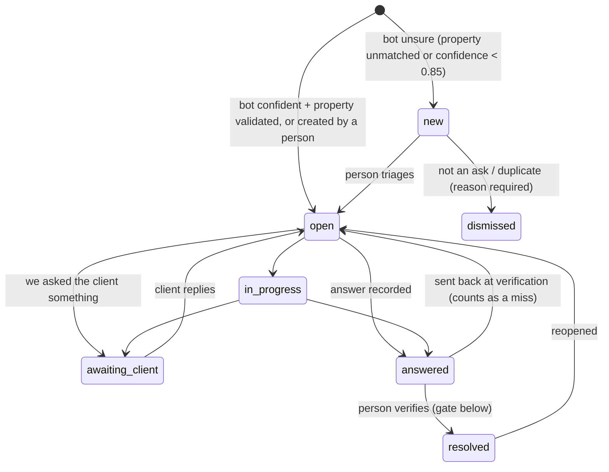
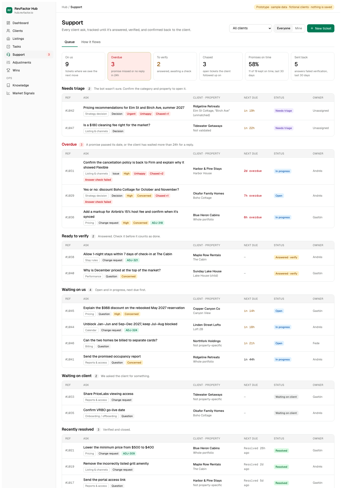
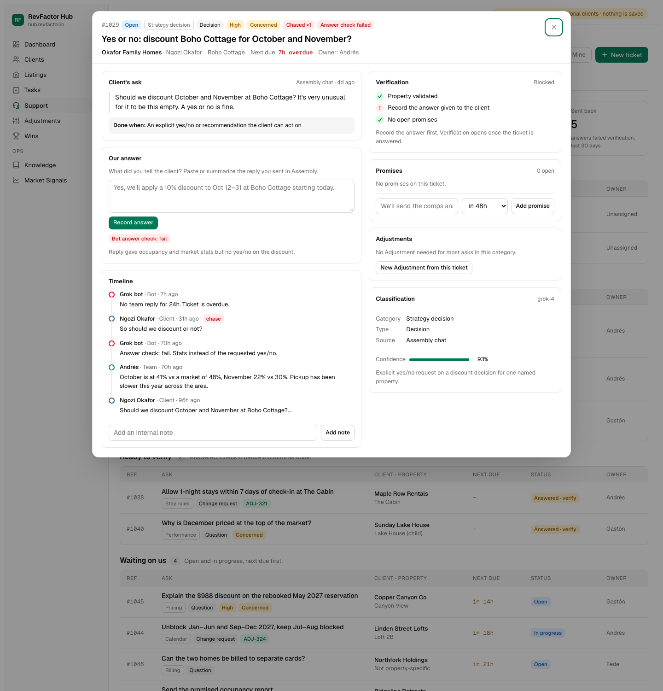
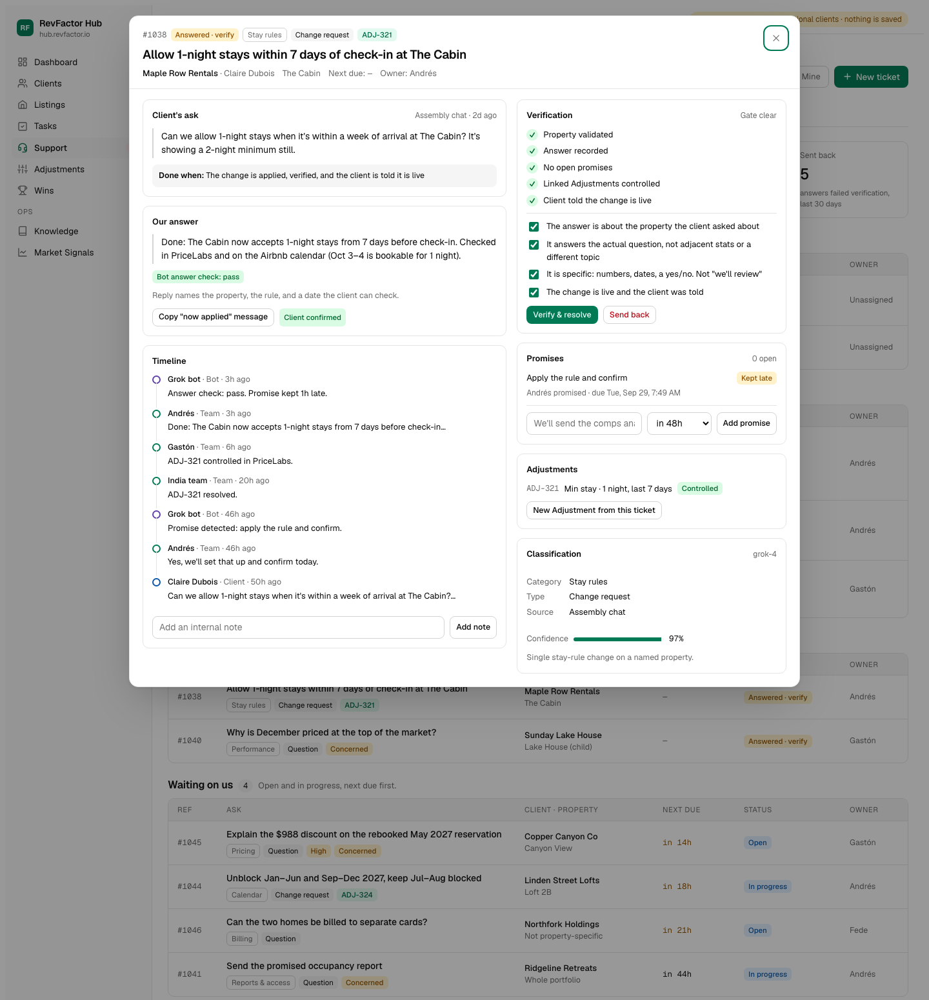
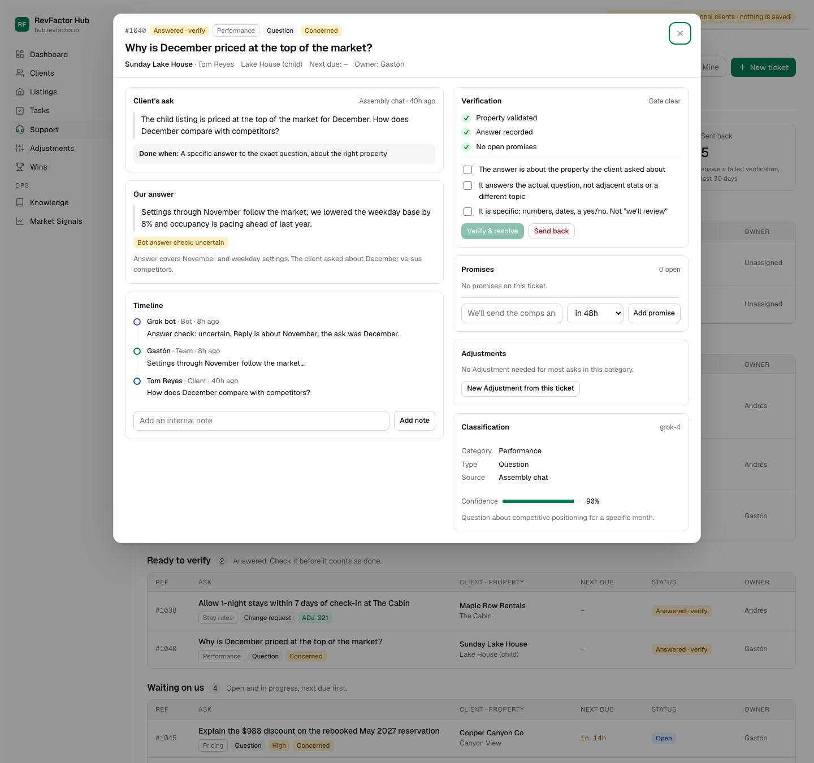
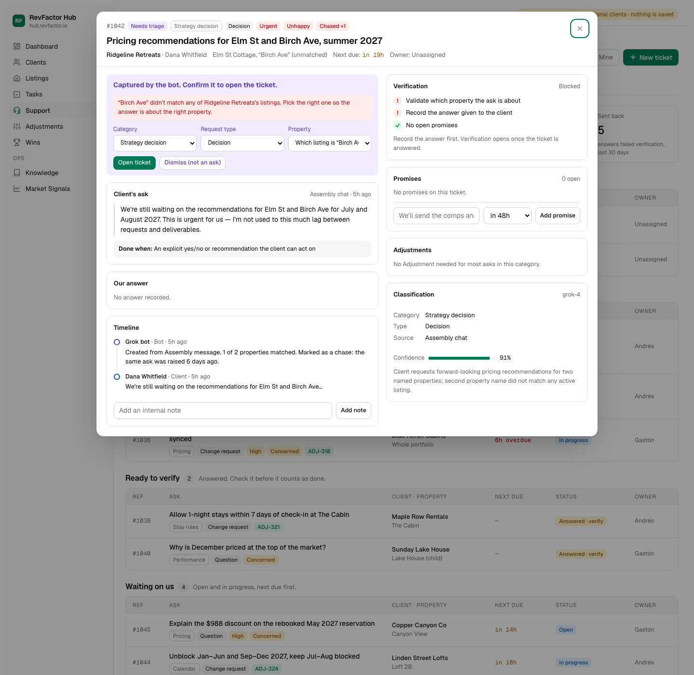
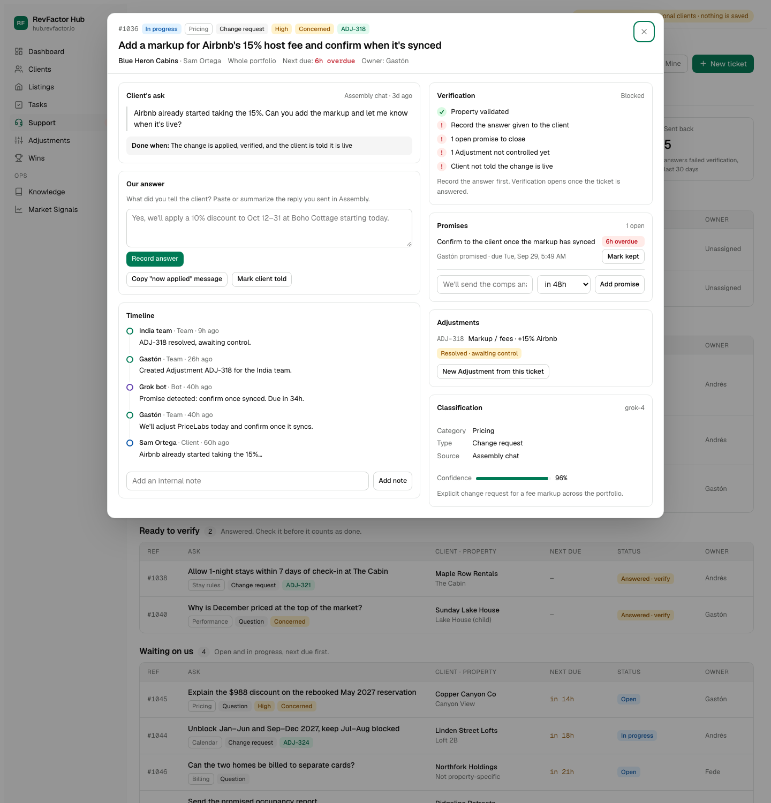
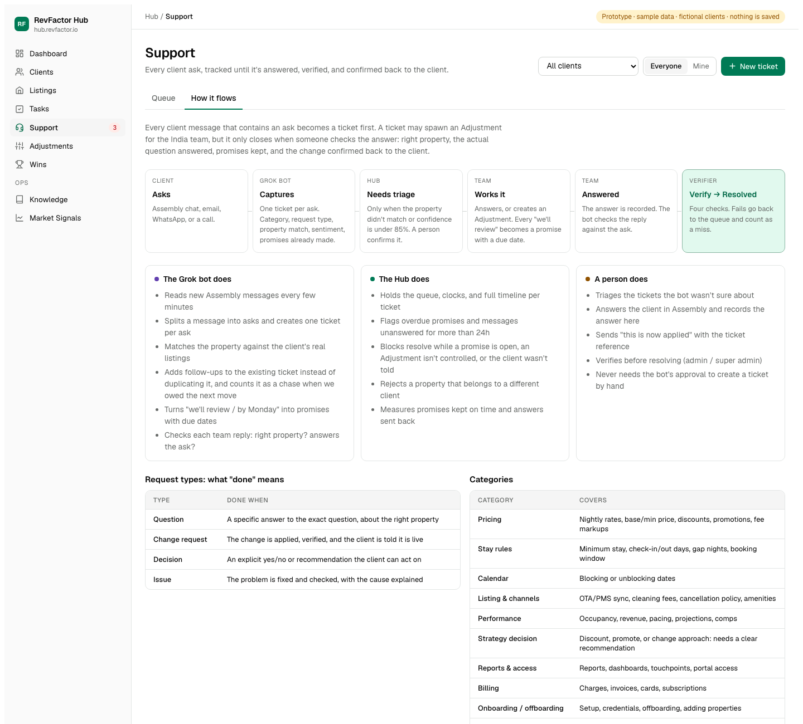
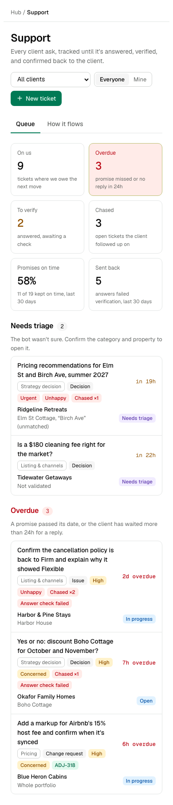

# RevFactor Support Tickets — model review brief for Grok

> **Superseded in part (2026-09-29):** the review's answers changed the model and the bot contract. See `grok-review-decisions.md` for the current contract (one capture call per message, processed-message ledger, revised categories, new event types). The migration is now `20260929160000_support_tickets.sql`.

Prepared 2026-09-29 for design review. **Nothing is deployed.** The database migration is a draft that has only run against a throwaway local Postgres; the Hub screens shown below are a clickable HTML prototype with fictional clients.

**What we are asking you to do:** review the ticket model (sections 3–7) and the screens (section 8) as the future builder of the capture bot, then answer the questions in section 9. For each answer give: your recommendation, why, what it would change in the schema or API contract, and how confident you are. Flag anything that would make capture unreliable or create duplicate tickets — that matters more to us than naming polish.

---

## 1. The problem

A 30-day audit of every RevFactor client chat in Assembly (Aug 29 – Sep 28, 2026) found that speed of the first reply is not the problem. Follow-through is.

| Measure | Result |
|---|---:|
| Active client chats | 72 |
| Messages | ~4,800 |
| Client messages that waited for a reply | 354 |
| Median wait for first reply | 2.4 h |
| 1 in 4 waited longer than | 15 h |
| Waited more than 24 h | 46 |
| Specific communication misses | 96 (across 46 chats) |
| Clients clearly unhappy | 13 |
| High churn risk | 9 |
| Chats with an ask where the next move is ours | 41 |

How the misses break down (one miss can count under more than one pattern):

| Pattern | Times seen |
|---|---:|
| Promised something ("we'll review / follow up"), never followed up | 52 |
| Client had to chase | 18 |
| Answered a different question or the wrong property | 11 |
| Vague non-answer | 8 |
| Said done / fixed, but it was not | 6 |
| Slow reply (over a day) | 3 |

Typical failures, anonymized:

- A client asked for a **yes or no** on an October/November discount and got occupancy statistics instead.
- A client asked about **December** pricing versus competitors and the reply covered November settings.
- The team agreed to keep a cancellation policy **Firm**, promised a discount audit, then the policy showed Flexible again and the audit never arrived.
- Changes (fee markups, minimum price, minimum stay) were made but the client was **never told they were live**.
- A high-risk client emailed asking for a call because they "had difficulty getting responses" and were "concerned that issues aren't caught before we request progress reports."

Today, explicit pricing changes are tracked as **Adjustments** (a queue for the India pricing team). General questions, strategy asks, and promises are not tracked anywhere.

## 2. Design decisions already made

1. **Every client ask becomes a support ticket first.** Whether it also needs an Adjustment is a second step decided from the ticket.
2. **One ticket per ask, not per chat thread.** A message with three asks creates three tickets.
3. **Tickets are internal.** Owners never see them. The only client-facing output is a "this is now applied" confirmation a person pastes into the chat.
4. **The request type defines "done".** A question needs a specific answer; a decision needs an explicit yes/no; a change needs to be live and confirmed to the client.
5. **Promises are first-class.** Every "we'll review / by Monday" becomes a promise with a due date. An open promise blocks closing the ticket.
6. **Two-step closure.** Someone records the answer (`answered`), then a person with verify rights checks it before it is `resolved`. A failed check sends the ticket back and counts as a miss.
7. **The bot captures and checks; it never closes.** It never resolves a ticket, never messages a client, and never changes PriceLabs, a PMS, or an OTA.
8. **Property validation is deterministic.** The bot suggests which property; the Hub matches it against that client's actual listings. The database rejects a property that belongs to a different client.
9. **Clock hours, including nights and weekends** — the same basis as the audit.

## 3. Data model

| Table | Purpose | Key fields |
|---|---|---|
| `support_tickets` | One row per client ask | `ticket_number` (human ref, e.g. #1029), `client_id`, `category`, `request_type`, `summary`, `client_message` (verbatim excerpt), `status`, `priority`, `client_sentiment`, `property_scope`, `property_validated_at`, `assignee_id`, conversation clocks (`first_response_at`, `last_client_message_at`, `last_team_message_at`, `client_chase_count`), answer fields (`answer_summary`, `answered_at`, `answer_check_verdict`, `answer_check_notes`), `client_confirmed_at`, `verification` snapshot, `verified_by`, `resolved_at`, `ai_classification` (model, confidence, rationale), `external_key` (bot idempotency), `source`, `source_message_id` |
| `support_ticket_listings` | Validated properties the ask is about | `ticket_id`, `listing_id` — trigger rejects a listing of another client |
| `support_ticket_commitments` | Promises | `description`, `due_at`, `status` (`open`/`kept`/`cancelled`), `made_by_name`, `source` (`bot`/`manual`), `external_key`, `closed_at`, `close_note` (required to cancel). "Late" is derived, never stored. |
| `support_ticket_events` | Append-only timeline | `event_type`, `actor_id` or `actor_label` (for bot-reported people), `body`, `payload`, `external_key`, `occurred_at` |
| `adjustments.support_ticket_id` | Adjustment spawned from a ticket | Trigger rejects linking to a ticket of a different client |

Access: a new permission resource `support`. Admins can view/create/edit/verify; delete is off by default (dismiss instead). External roles (HostPricing partner, contractors, marketing) are explicitly denied. The bot writes through a scoped API key, not a user session.

## 4. Taxonomy

### Categories (topic)

| Value | Label | Covers |
|---|---|---|
| `pricing` | Pricing | Nightly rates, base/min price, discounts, promotions, fee markups |
| `stay_rules` | Stay rules | Minimum stay, check-in/out days, gap and orphan nights, booking window |
| `availability` | Calendar | Blocking or unblocking dates |
| `listing_setup` | Listing & channels | OTA/PMS sync, cleaning fees, cancellation policy, amenities, VRBO/Airbnb settings |
| `performance` | Performance | Occupancy, revenue, pacing, projections, comparable listings |
| `strategy` | Strategy decision | Should we discount / promote / change approach — needs a clear recommendation |
| `reporting` | Reports & access | Reports, dashboards, touchpoints, portal access |
| `billing` | Billing | Charges, invoices, cards, subscriptions |
| `account` | Onboarding / offboarding | Setup, credentials, offboarding, adding or removing properties |
| `other` | Other | Anything else |

`pricing`, `stay_rules`, `availability`, and `listing_setup` usually need a PriceLabs change, so the ticket suggests creating an Adjustment.

### Request types (what "done" means)

| Value | Done when |
|---|---|
| `question` | A specific answer to the exact question, about the right property |
| `change` | The change is applied, verified, and the client is told it is live |
| `decision` | An explicit yes/no or recommendation the client can act on |
| `issue` | The problem is fixed and checked, with the cause explained |

### Other fields

- `priority`: `low` · `medium` · `high` · `urgent`
- `client_sentiment`: `neutral` · `concerned` · `unhappy`
- `property_scope`: `listings` (specific, rows in `support_ticket_listings`) · `portfolio` · `account` (not property-specific) · `unknown` (not validated yet)
- `source`: `assembly` · `email` · `whatsapp` · `call` · `manual`

## 5. Lifecycle



| Status | Label in the Hub | Ball is with |
|---|---|---|
| `new` | Needs triage | Us |
| `open` | Open | Us |
| `in_progress` | In progress | Us |
| `awaiting_client` | Waiting on client | Client |
| `answered` | Answered — verify | Us (verifier) |
| `resolved` | Resolved | Nobody |
| `dismissed` | Dismissed | Nobody |

### Clocks and thresholds

| Rule | Value |
|---|---|
| Reply SLA: a client message with no team reply becomes overdue after | 24 clock hours |
| Default due date for a promise made without one | 48 hours after it was made |
| "Due soon" window | 24 hours |
| Bot tickets skip triage when confidence is at least | 0.85 **and** the property is validated |

**Next due** for a ticket = the earliest of (open promise due dates, last unanswered client message + 24 h). Waiting-on-client tickets only count promises.

**Chase** = a client message that arrives while we already owed the next move (an unanswered client message or an overdue promise). It increments `client_chase_count` and is marked in the timeline.

### Queue buckets (exclusive, first match wins)

1. **Needs triage** — status `new`
2. **Overdue** — next due is in the past (outranks everything but triage: a broken promise is the most common failure)
3. **Ready to verify** — status `answered`
4. **Waiting on us** — open / in progress, sorted by next due
5. **Waiting on client** — `awaiting_client`
6. **Recently resolved**

## 6. Verification gate

The database refuses to mark a ticket `resolved` unless **all** of these hold (enforced by a trigger, so it also applies to anything writing through the service role):

1. A verifier is recorded.
2. The property is validated (scope is not `unknown`).
3. An answer is recorded.
4. No promise is still open.
5. For `change` tickets: every linked Adjustment is controlled or rejected, **and** the client was told the change is live.

The verifier also ticks a human checklist before the button enables:

- The answer is about the property the client asked about.
- It answers the actual question — not adjacent stats or a different topic.
- It is specific: numbers, dates, a yes/no — not "we'll review".
- The change is live and the client was told (change requests only).

Reopening a resolved ticket clears the verification; the timeline keeps the historical snapshot.

## 7. Capture bot contract (proposed)

The request/response schemas are written (Zod, in `lib/support-tickets.ts`); the routes are **not built yet**, so this is the right time to change them.

**Auth:** `Authorization: Bearer rvf_live_<64 hex>` with scopes `support:write` (create tickets, post events) and `support:read` (list tickets). Keys are issued and revoked by script; 401 invalid, 403 missing scope.

### 7.1 Create tickets — `POST /api/v1/support-tickets` (`support:write`)

Batch of 1–50 candidates. **Idempotent by `external_key`**: re-sending an existing key returns the existing ticket unchanged (the bot never overwrites what a person edited).

```json
{
  "tickets": [
    {
      "external_key": "assembly:msg_8f2c1:0",
      "client": { "assembly_company_id": "comp_123" },
      "summary": "Yes or no: discount Boho Cottage for October and November?",
      "client_message": "Should we discount October and November at Boho Cottage? It's very unusual for it to be this empty. A yes or no is fine.",
      "requested_by_name": "Ngozi Okafor",
      "requested_at": "2026-09-25T14:05:00Z",
      "source": "assembly",
      "source_message_id": "msg_8f2c1",
      "category": "strategy",
      "request_type": "decision",
      "priority": "high",
      "client_sentiment": "concerned",
      "property": {
        "scope": "listings",
        "listings": [{ "name_hint": "Boho Cottage" }]
      },
      "ai": {
        "model": "grok-4",
        "confidence": 0.93,
        "rationale": "Explicit yes/no request on a discount decision for one named property."
      },
      "commitments": []
    }
  ]
}
```

Field rules:

- `external_key`: 3–200 chars. Proposed scheme `assembly:<messageId>:<askIndex>`.
- `client`: at least one of `hub_client_id`, `assembly_client_id`, `assembly_company_id`. Ambiguous company matches are rejected.
- `summary` 3–300 chars (restated ask); `client_message` ≤ 8,000 chars.
- `property.listings[]` (≤ 25): each needs at least one of `hub_listing_id`, `pricelabs_listing_id`, `airbnb_id`, `name_hint`.
- `commitments[]` (≤ 10): promises the team already made before the ticket existed — `external_key`, `description`, optional `due_at`, `made_at`, `made_by_name`.

**Property matching order** (only against the ticket client's own listings): Hub listing ID → PriceLabs listing ID → Airbnb ID (from the stored Airbnb link) → name hint. Name matching is exact on the normalized full name or the part before the first `|` (internal names look like `Cabin | TN | Owner`), then a unique partial match for hints of 4+ characters. Anything unmatched keeps the ticket in triage and is reported back.

Planned response:

```json
{
  "results": [
    {
      "external_key": "assembly:msg_8f2c1:0",
      "outcome": "created",
      "ticket_id": "7b0c…",
      "ticket_number": 1029,
      "status": "open",
      "property_validated": true,
      "unresolved_listings": []
    }
  ]
}
```

`outcome` is `created`, `existing`, or `error` (with `error` text). One bad candidate does not fail the batch.

### 7.2 List tickets — `GET /api/v1/support-tickets` (`support:read`)

So the bot can attach follow-ups to an existing ticket instead of creating a duplicate. Filters: `status` (default: all active), `hub_client_id` / `assembly_client_id` / `assembly_company_id`, `updated_since`, `limit` ≤ 100, cursor. Each row: id, number, external key, status, category, request type, summary, client IDs, property scope and listing names, open promises (id, external key, description, due), the three conversation timestamps. **Excluded:** internal notes, verification details, anything financial.

### 7.3 Post events — `POST /api/v1/support-tickets/{id}/events` (`support:write`)

Batch of 1–20. Every event has `type`, `external_key` (idempotency — usually the Assembly message ID), `occurred_at`, optional `actor_label` (the person as seen in the chat).

```json
{
  "events": [
    {
      "type": "team_reply",
      "external_key": "assembly:msg_9a01",
      "occurred_at": "2026-09-26T16:40:00Z",
      "actor_label": "Andrés",
      "body": "October is at 41% vs a market of 48%, November 22% vs 30%.",
      "answer_check": { "verdict": "fail", "notes": "Stats instead of the requested yes/no." },
      "proposes_answered": false
    },
    {
      "type": "commitment_made",
      "external_key": "assembly:msg_9a01:promise",
      "occurred_at": "2026-09-26T16:40:00Z",
      "actor_label": "Andrés",
      "commitment": {
        "external_key": "assembly:msg_9a01:p0",
        "description": "Send a discount recommendation for Oct–Nov",
        "due_at": "2026-09-28T16:00:00Z",
        "made_by_name": "Andrés"
      }
    },
    {
      "type": "client_message",
      "external_key": "assembly:msg_9b77",
      "occurred_at": "2026-09-28T09:12:00Z",
      "actor_label": "Ngozi Okafor",
      "body": "So should we discount or not?"
    }
  ]
}
```

| Event type | Effect on the ticket |
|---|---|
| `client_message` | Updates `last_client_message_at`. Counts as a **chase** if we already owed the next move. Moves `awaiting_client` → `open`. On a resolved/dismissed ticket it reopens only when `reopen: true`. |
| `team_reply` | Updates `last_team_message_at` (and `first_response_at` if empty). Stores `answer_check` (`pass` / `fail` / `uncertain` + notes). `proposes_answered: true` moves open / in progress / waiting on client → **answered** with the reply as the answer summary. Never resolves. |
| `commitment_made` | Creates a promise; with no `due_at`, due = `made_at` (or `occurred_at`) + 48 h. |
| `commitment_kept` | Closes the promise named by `commitment_external_key` at `occurred_at` (on time or late is derived). |
| `note` | Timeline only. |

Re-sending an event with a known `external_key` has no effect and is reported as a duplicate.

## 8. Screens (prototype, fictional data)

The screenshots are in `review-screenshots/` next to this file.

### 8.1 Queue



Header numbers: tickets on us, overdue, waiting for verification, chased, promises kept on time (30 days), answers sent back at verification (30 days). Each row shows category and request type, flags (urgent/high, unhappy/concerned, chase count, failed answer check, linked Adjustment), the client and validated property, next due, status, and owner.

### 8.2 Overdue decision — the "stats instead of a yes/no" case



The bot's answer check failed the earlier reply. The client chased; 24 h passed with no reply, so the ticket is overdue.

### 8.3 Ready to verify — a change request that passes the gate



Property validated, answer recorded, promise closed (kept late), Adjustment controlled, client told. The verifier's four checks are ticked and **Verify & resolve** is enabled.

### 8.4 Answered about the wrong month — should be sent back



The gate is technically clear, but the bot marked the answer `uncertain`: the client asked about December and the reply covers November. The verifier should use **Send back**, which records a verification miss.

### 8.5 Triage — one property did not match



The client named two properties; "Birch Ave" matched none of that client's listings, so the ticket waits for a person to pick the right one before it opens.

### 8.6 Change blocked — Adjustment not controlled, promise overdue



### 8.7 How it flows (who does what)



### 8.8 Phone width



## 9. Questions for you

1. **Splitting asks.** What rules would you use to split one message into separate asks, and to decide whether a new message is a follow-up on an existing ticket or a new ask? How do you avoid a duplicate when the client restates an old ask in new words?
2. **Idempotency key.** `assembly:<messageId>:<askIndex>` breaks if a re-run splits the same message differently (a different model, a prompt change). Should the key be derived from something more stable, and what?
3. **Taxonomy fit.** Do the 10 categories and 4 request types cover what you see in the chats? Can you tell `performance` from `strategy`, and `question` from `decision`, reliably? What would you merge, split, or add?
4. **Confidence.** Is a single 0.85 threshold right, or should you report confidence per field (category, request type, property) and triage on the weakest one?
5. **Promise detection.** Which phrasings should create a promise? How should you resolve relative dates ("tomorrow", "by Monday", "end of week"), and in which time zone? Should a vague "we'll review" get a shorter default than 48 h?
6. **Answer check.** Propose a rubric for `pass` / `fail` / `uncertain`, what evidence belongs in the notes, and when you would set `proposes_answered`. How do we keep false `fail`s from eroding trust in the flag?
7. **Chases.** Is our definition (a client message while we already owed the next move) right? Should a polite "any update?" before the due date count?
8. **Reply SLA.** 24 clock hours, nights and weekends included, matches the audit. Would you recommend business hours or a different number?
9. **Priority and sentiment.** Should the bot set priority from sentiment and churn signals? Should churn risk live on the client instead of each ticket?
10. **Missing events.** Is anything missing from the event types — for example, the client acknowledging an answer, a hand-off to the India pricing team, or the client rejecting an answer?
11. **Daily digest.** The team wants a daily summary. Should it be generated from ticket data (the list endpoint) instead of re-reading chats? What should it contain, and for whom?
12. **Privacy.** We store verbatim client excerpts (up to 8,000 characters) internally. Should the bot redact emails, phone numbers, and URLs before sending them, as Agent Studio does?
13. **Backfill.** On day one, should the bot backfill the open asks from the last 30 days (41 chats)? How should backfilled tickets be marked so they don't distort the metrics?
14. **Anything else** that would make this model fail in practice.

## 10. Out of scope for this layer

- Sending anything to clients (Assembly, email, WhatsApp). People send; the Hub offers a copy-ready "now applied" message.
- Any PriceLabs, PMS, or OTA change. Those go through Adjustments, created by a person from the ticket.
- Owner-facing ticket views.
- Automatic resolution by the bot, in any case.

## 11. Build status

| Piece | State |
|---|---|
| Migration `092_support_tickets.sql` (tables, access rules, gate triggers) | Written; passed 15 behavior checks on a throwaway local Postgres; **not applied** anywhere |
| `lib/support-tickets.ts` (taxonomy, queue rules, gate, property matcher, API schemas) | Written; not yet unit-tested |
| API routes for the bot | Not started — waiting on this review |
| Hub pages (`/support`, ticket detail) | Prototype only (screens above) |
